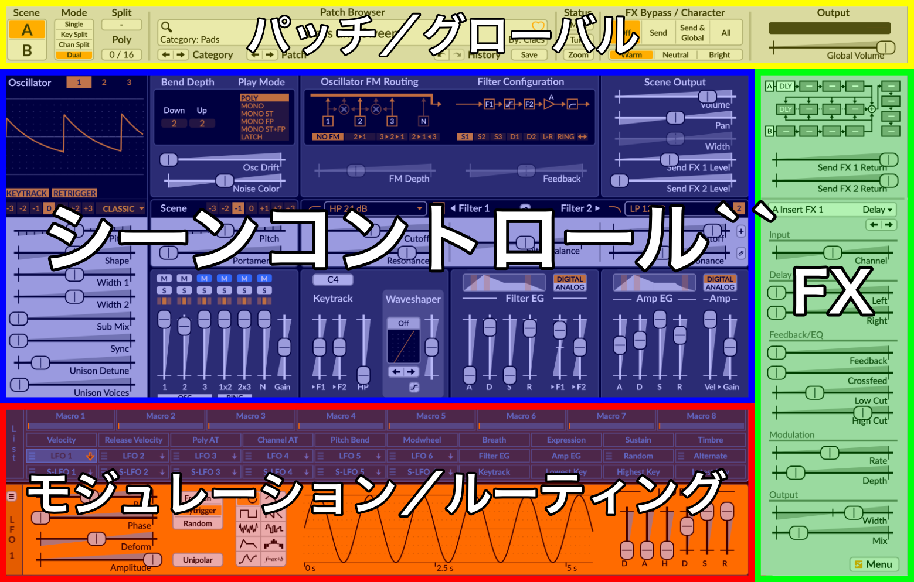
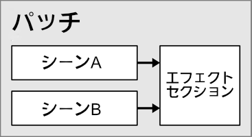
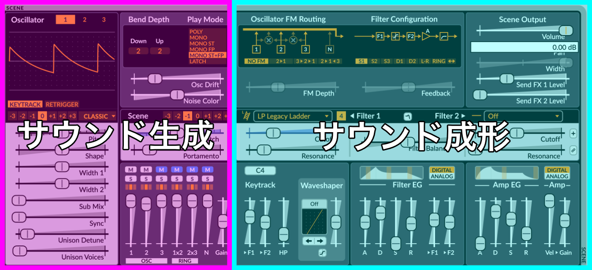
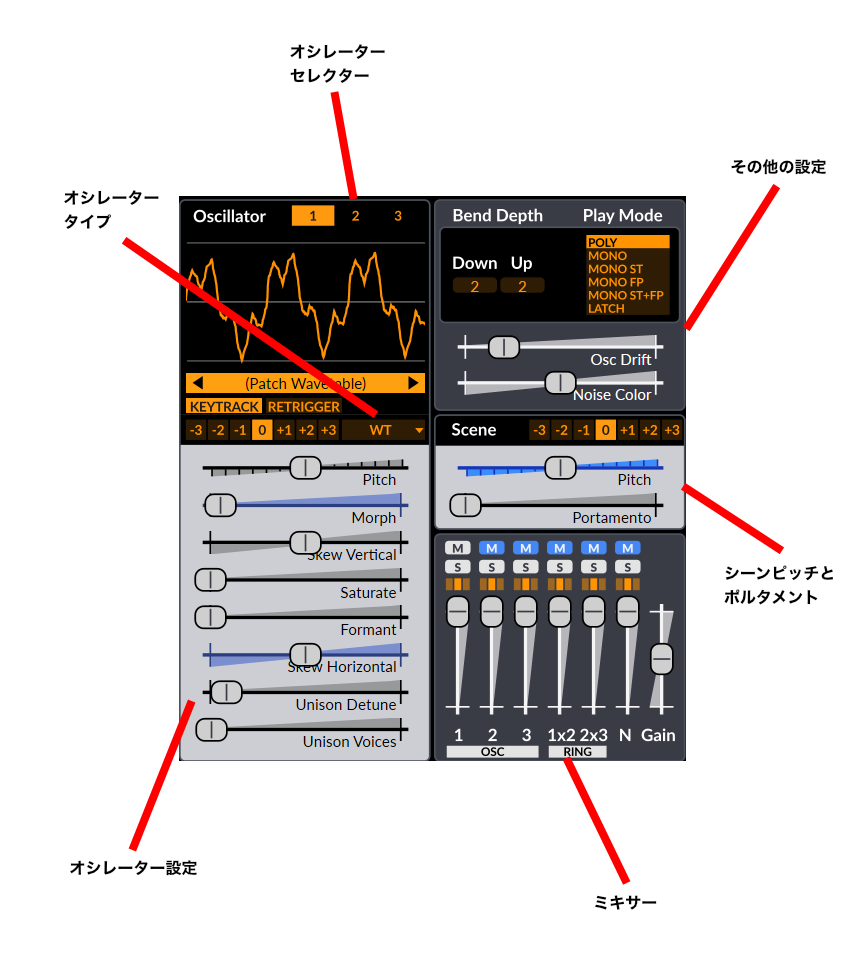

[PDF 版](https://github.com/surge-synthesizer/surge-synthesizer.github.io/releases/download/surge-xt-manual/Surge-XT-Manual.pdf)

# はじめに
{: #getting-started}

**Surge XT** をご使用いただきありがとうございます！

Surge XT は当初 "Surge" の名称でリリースされていたバーチャルシンセサイザーが、制作者である Claes Johanson によって2018年9月にオープンソース化されたもので、それ以来有志のグループによって保守されています。

本書の前半部では、このシンセサイザー特有のいくつかのコンセプトについてご紹介すること、そして Surge XT の可能性を最大限に引き出すためのナビゲーション、操作、および 使用方法についての導入として意図されています。

Surge XT のシンセシスエンジンやその他の高度な技術仕様とオプションに関する詳細情報については、後半部の[テクニカルリファレンス](#technical-reference)をご参照ください。

本マニュアルで使用されている大部分の画像や説明文については、 Classic スキンを前提に記載されています。 これはこのスキンが Surge XT の初回起動時に使用される既定のスキンであるためです。

最後に、さらなるヒントやテクニック、チュートリアル、そして追加コンテンツのダウンロード方法については、 [Surge's wiki](https://github.com/surge-synthesizer/surge-synthesizer.github.io/wiki) をご覧ください。

## Surge XT のインストールとビルド
{: #installing-or-building-surge-xt}

*Audio Units および AU は Apple Computer, Inc の商標です。
VST は Steinberg Media Technologies GmbH* の商標です。

Surge XT のインストーラーは [https://surge-synthesizer.github.io](https://surge-synthesizer.github.io) からご利用いただけます。

### Windows

Windows プラットフォームでは、 Surge XT は32ビットおよび64ビットの VST3 および CLAP プラグインインストゥルメントとして提供されています。

VST3版のファイル名は `Surge XT.vst3` 、 CLAP 版は `Surge XT.clap` になります。

システム要件:

  - Windows 7 以降
  - じゅうぶん高速な CPU (Pentium 4/Athlon 64 以上)
  - 少なくとも 4GB の RAM
  - VST 互換のホストアプリケーション

64ビット版の Windows をご使用の場合は、上記に加えて以下も追加で必要になります:

  - x64 (AMD64/EM64T) 命令セットをサポートする CPU
  - **64-bit** ビット版の Windows
  - 64ビットの VST プラグインホスト可能なアプリケーション

VST3 と CLAP 、いずれのバージョンにおいても、プラグインはそれぞれの既定の場所に自動でインストールされ、 VST3 や CLAP に準拠したホストアプリケーションによって認識されますが、 Windows 版では**ポータブルモード**も利用可能です:

- ポータブルモードを使用すると、 Surge XT の VST3 および CLAP プラグインと同じフォルダーに関連ファイルを保存することができます。
- Surge XT のインストールされたフォルダーに `SurgeXTData` というフォルダーが存在する場合、工場出荷時データを読み込みの際 `%DOCUMENTS%\Surge XT` の代わりにそちらを参照するようになります。
- 同フォルダーに `SurgeXTUserData` というフォルダーが存在する場合、 Surge XT はユーザーデータの読み込みの際、 `%DOCUMENTS%\Surge XT` の代わりにそちらを参照するようになります。
- これらのフォルダーはまったく存在しなくても、ひとつのみでも、あるいは両方存在してもかまいません。 もしそれらが存在しない場合は、 Surge XT は既定の場所を参照するようフォールバックされます。

### macOS

Mac 向けには、 Audio Unit (AU) 、 VST3 、 および CLAP プラグインインターフェイスの64ビット版プラグインとして提供されます。

システム要件:

  - Mac OS X 10.11 以降
  - 64ビット版の x86 Intel または ARM Apple Silicon CPU
  - 少なくとも 4GB の RAM
  - 64ビット版 AU または VST 互換のホストアプリケーション

インストールにはパッケージインストーラーを使用してください。 AU 版の `Surge XT.component` と、 VST3 または CLAP プラグインについてそれぞれの現在の保存場所に自動的にインストールを行うためのオプションが表示されます。
工場出荷時のパッチとウェーブテーブルも自動的にインストールされます。

パッケージインストーラーを実行すると、その Mac の全ユーザーに対して Surge XT がインストールされます。

### Linux

Linux では、 Surge XT は **deb** および **RPM** パッケージ形態の64ビット版 VST3 および CLAP プラグインとして提供されます。

Linux には多くのディストリビューションが存在し、また他の要因も相まってシステム要件を定義することは困難ですが、下記の情報は役に立つでしょう:

- **Surge XT の Web サイト** 上のインストールパッケージは Debian パッケージの形態で提供されます
- 配布パッケージは Ubuntu 18.04 でビルドされています
- 必須のパッケージについてはソースコードおよび deb ファイルに一覧されています

**メモ:** Surge XT の操作の一部には Alt キーを押しながらのドラッグやスクロールホイールの操作が必要になりますが、一部の Linux ディストリビューションではこれらのショートカットやジェスチャーが Surge XT とデスクトップ環境との間で競合する可能性があります。
私たちは、とあるディストリビューションのとあるウィンドウマネージャーの標準設定で Alt キーを押しながらのドラッグを使用しているからという理由で、全プラットフォームでこの操作方法を諦めるという決定はしたくありませんでした。
たいていの場合はデスクトップ環境のそのようなグローバルジェスチャーをオフにできますし、それがこのような問題を解消するもっとも簡単な方法になるでしょう。

### ソースコードからのビルド
{: #building-from-source}

Surge XT をソースコードからビルドしたい場合は、 [Github リポジトリー](https://github.com/surge-synthesizer/surge)内の手順を参照してください。

## 旧バージョンとの共存インストール

Surge XT は Surge の進化形ではある一方、まったく新しいプラグインでもあります。 これは Surge 1.9 以前のバージョンとの共存インストールが簡単に行えること、そして旧バージョンの Surge を使用しているプロジェクトを開くには引き続き Surge 1.9 を削除せず併存させておく必要があることを意味します。

## 各ファイルの保存場所
{: #locations}

### Windows

パッチライブラリーとウェーブテーブルは `C:ProgramData\Surge XT` に保存されています。
ユーザーパッチは `C:\Users\your username\My Documents\Surge XT` に保存されています。

### macOS

パッチライブラリーとウェーブテーブルは `/Library/Application Support/Surge XT` に保存されています。
ユーザーパッチは `~/Documents/Surge XT` に保存されています。

### Linux

標準インストールでは、パッチライブラリーとウェーブテーブルは `/usr/share/surge-xt` に保存されています。
ユーザーパッチは `~/Documents/Surge XT` に保存されます。 このフォルダーは、パッチの保存や、ユーザー既定の設定変更を初回に行なった際に作成されます。

メモ: この保存場所は Surge XT のメニューから変更が可能です ([データフォルダー](#data-folders)を参照してください) 。

工場出荷データフォルダー内にユーザー自身のコンテンツを保存したり既存のデータを変更した場合、将来のバージョンのインストールでこれらは消去されます。
Surge XT のインストーラーはユーザーデータの格納場所には一切手を加えません。

したがってカスタムスキンをインストールしたり、パッチを保存したり、その他コンテンツの追加を行う場合、工場出荷データのフォルダーではなくユーザーデータフォルダーに保存するようにしてください。 これによって、 Surge XT のアップグレード時にデータを失うリスクを回避できます。

# ユーザーインターフェイスの基本
{: #user-interface-basics}

Surge XT のユーザーインターフェイスは主に4つのセクションに分けられます:
  - ヘッダー
  - シーンコントロール
  - モジュレーションとルーティング
  - エフェクト

この構成を頭に入れておくと、レイアウトの理解が容易になります。

*Surge XT のユーザーインターフェイスで分割されている4つのセクション*

## シーンの概念
{: #the-scene-concept}

Surge XT のすべてのパッチは2つのシーン (AおよびB) とエフェクトセクションから構成されます。
二つのシーンと全エフェクト設定の両方がパッチに保存されます。 シーンにはボイスのシンセサイズに使用される全情報が保存されるという点で、従来のシンセサイザーのパッチと似ています。
Surge XT のパッチには2つのシーンが含まれるため、ひとつのパッチ内でレイヤー (複数の音色を重ね合わせて同時に演奏すること) やスプリット (複数の音色を鍵域によって弾き分けること) といった音色を作成可能です ( [シーンの選択とシーンモード](#scene-select-and-scene-mode) を参照してください) 。

## オーディオ出力
{: #audio-outputs}

DAW によってプラグインがロードされると、 Surge XT の各インスタンスには**3つのオーディオ出力**が用意されます:

- ステレオ出力
- シーンA出力
- シーンB出力

ホストアプリケーションによっては、これら出力を個別に加工できるように使用、ルーティングできます。

## スライダーとコントロール
{: #sliders-and-controls}

Surge XT でもっとも一般的なユーザーインターフェイスコントロールはスライダーです。 スライダーには横向きのものと縦向きのものがありますが、見た目以外の機能は同一です。

スライダーは常にドラッグで操作され、スライダーのつまみの代わりに溝をクリックしても値が瞬時に変化したりせず、ドラッグ操作モードに移行します。

スライダーで行える操作:
  - **左クリック後ドラッグ** - スライダーの移動
  - **Shift キー + 左クリック後ドラッグ** - スライダー移動 (微調整)
  - **Ctrl/command キー + 左クリック後ドラッグ** - スライダー移動 (決まった数値を基準とする段階的な調整)
  - **Alt/option キー + 左クリック後ドラッグ** -　ゴムバンドモードでスライダー移動 (マウスボタンを話すとスライダーが元の位置に戻る)
  - **マウスホイール** - スライダー移動
  - **Shift キー + マウスホイール** - スライダー移動 (微調整)
  - **左ボタンをダブルクリック** - パラメーターを既定値にリセット
  - **右クリック** - コンテキストメニュー
  - **ホバー (マウスカーソルを重ねる)** - クリックせずにスライダーの現在値を確認

Surge XT のパラメーターはスライダーの他に、数値の入力フィールドやボタン、およびボタン列で表示されるものもあります。

## 取り消しとやり直し
{: #undo-and-redo}

[パッチブラウザー](#patch-browser)の下、**保存**ボタンの左側に曲がった矢印のボタンがあります。
これらボタンをクリックすると直前の変更を取り消し (Undo) したりやり直し (Redo) したりできます。
また、キーボードショートカットを使用して取り消し (既定では Ctrl + Z) ややり直し (既定では Ctrl + Y) を行うことも可能です。

### パラメーターコンテキストメニュー
{: #parameter-context-menu}

マウスの右クリックで、任意のパラメーターのコンテキストメニューを開くことができます。 このメニューには数々の便利な機能があります。

#### 名前と状況依存ヘルプ
{: #name-and-contextual-help}

最初のオプションをクリックすると、本ユーザーマニュアル内で該当のパラメーターについて説明されている正しい箇所が開きます。
また、オプションにマウスカーソルを合わせて F1 キーをクリックしても同様の結果が得られます。

#### 数値の編集 (Edit Value)
{: #edit-value}

このオプションを使用すると、パラメーターを希望する値にキーボードから直接入力できます。
数値のポップアップが表示されると文字列がすでに選択状態となっているので、すぐに新しい値を入力開始できます。 完了したら Enter キーを押して変更を確定します。
変更をキャンセルしてポップアップを閉じるには、 Escape キーを押すか他のパラメーターに移動します。 Surge XT の数値入力ウィンドウでは、値の入力時に単位を添える必要はありません。

固定値から選択するタイプのパラメーター (ユニゾン発音数やボタン列など) については、数値入力ウィンドウの代わりに、選択可能なすべての数値がメニューに表示されるので、それらを直接選択できます。

#### 数値の範囲を拡張 (Extend Range)
{: #extend-range}

一部のパラメーターでは、その数値の範囲を拡張できます。 そのようなパラメーターのコンテキストメニューには**値の範囲を拡張 (Extend range)** オプションが表示されます。
たとえば**ピッチ (Pitch)** がそのようなパラメーターに該当します。

#### テンポの同期 (Tempo Sync)
{: #tempo-sync}

一部のパラメーターはホストアプリケーションのテンポと同期でき、そのようなパラメーターには**テンポの同期 (Tempo sync)** オプションがコンテキストメニューに表示されます。

Surge XT の Classic スキンでテンポの同期を使用すると、下図のようにスライダーのハンドルに "TS" マークが表示され、現在の状態を反映します:

この表示は使用中のスキンによって異なります。

#### 有効／無効
{: #enabled}

一部のパラメーターでは有効、無効の状態を切り替えることができます。 スライダーが半透明だったり、あるいはハンドルがなかったりする場合は、パラメーターが無効になっている可能性があります。
有効、無効を切り替えるには、該当する選択肢をクリックします。

#### モジュレーション
{: #modulations}

右クリックされたスライダーで、ひとつまたは複数のモジュレーションソースによるモジュレーションがオンになっている場合 (スライダーが青みがかっている場合) 、このメニューセクションが表示されます。 詳細については[ルーティング](#routing)を参照してください。

- **赤い X アイコン** - モジュレーションソース名の左側にあるこのアイコンをクリックすると、対応するモジュレーションルーティングが削除されます。
- **スピーカーアイコン** - クリックすると対応するモジュレーションソースをミュート (バイパス) できます。 もう一度クリックするとミュート解除します。
- **鉛筆アイコン** - クリックするとモジュレーション量の数値入力ウィンドウが表示されます。 希望するモジュレーション量を入力すると対応するパラメーターに変更が反映されます。 詳しくは[数値の編集 (Edit Value)](#edit-value) を参照してください。

#### モジュレーションの追加 (Add Modulation From...)
{: #add-modulation-from}

名前の示すように、このメニュー項目を使用すると右クリックされたコントロールとモジュレーション先とをリンクできます。
利用可能なモジュレーションソースはすべてカテゴリーごとに整理されているので、簡単にお目当ての項目を見つけることができます。
モジュレーションソースを選択すると数値入力ウィンドウが表示され、適用したいモジュレーション量を入力できます。

#### パラメーターのアサイン (Assign Parameter To...)
{: #assign-parameter-to}

このオプションを使用すると、右クリックされたパラメーターに対して任意の MIDI コントロールチェンジを割り当てることができます。

#### MIDI メッセージの学習 (MIDI Learn)
{: #midi-learn}

この項目を使用して MIDI コントローラーに希望するスライダーを割り当てることができます。 パラメーターに対する MIDI メッセージの学習を中断するには、もう一度右クリックします。
すると、メニュー項目名が**パラメーターの MIDI メッセージ学習の中断 (Abort Parameter MIDI Learn)** に変化します。

#### 学習済み MIDI メッセージのクリア (Clear learned MIDI)
{: #clear-learned-midi}

選択されたパラメーターがすでに MIDI メッセージを学習済みの場合にこのオプションが表示されます。 これを使用してスライダーと MIDI コントローラーとのリンクを解除できます (既存の MIDI コントロールチェンジ番号が括弧付きで表示されます) 。

#### VST3 オプション (VST3 Options)
{: #vst3-options}

VST3 版の Surge XT では VST3 のコンテキストメニュー項目がサポートされます。
ホストアプリケーションにより数は異なりますが、オートメーションや MIDI 、あるいはパラメーター数値に関するオプションが表示されます。

# ヘッダー
{: #header}

## シーンの選択とシーンモード
{: #scene-select-and-scene-mode}

ユーザーインターフェイスのシーンセクション内のすべてのコントロールには二組のセットアップが存在しています。
**シーン選択**ボタン **[A|B]** を使用して、現在どちらのシーンが選択状態にあり編集可能か指定することができます。
これらのボタンを右クリックして表示されるコンテキストメニューを使用して、シーンの内容をコピー、ペーストすることができます。

**シーンモード**に応じて、これら二つのボタンを使用して現在どちらのシーンが*発音される*か選択できます。
実際には、打鍵時にそれぞれのシーンで音が鳴るかどうかは、**シーンモード**の設定によって決まります:

  - **シングル (Single)** – 選択されたシーンのみで音が鳴ります。
  - **キースプリット (Key Split)** – **スプリットキー**より低いノートにはシーンAが、**スプリットキー**と同じか高いノートにはシーンBが使用されます。
  - **チャンネルスプリット Channel Split** - **スプリット MIDI チャンネル**より小さい数字の MIDI チャンネルのノートにはシーンAが、**スプリット MIDI チャンネル**と同じか大きい MIDI チャンネルのノートにはシーン　Bが、それぞれ発音に使用されます。
  - **デュアル (Dual)** – 全鍵域で両方のシーンの音が鳴ります。

MPE がオフの場合、**キースプリット**および**デュアル**の両モードでは MIDI チャンネルルーティングがサポートされます。 これによってチャンネル2を使用して演奏するとシーンAのみが、チャンネル3を使用して演奏するとシーンBのみがそれぞれ発音され、 MIDI チャンネル1およびチャンネル3より大きいチャンネルすべてではスプリットまたはデュアルモードとして発音されます。

**同時発音数 (Poly)** では現在発音中のボイス数が表示され、この値を横方向にドラッグすることで発音の許容されるボイスの最大数を設定できます。
発音数を超過したボイスが不自然に途切れることのないよう、ボイスリミッターがこれを目立たないように消音しますので、ボイス数が制限を超えていても、あまり神経質になる必要はありません。

## パッチブラウザー
{: #patch-browser}

### ナビゲーション
{: #navigation}

Surge XT での音色の切り替えは簡単です: 好みの音色が見つかるまで矢印ボタンをクリックし続けるだけです。 パッチ名のフィールド (白いエリア内の任意の箇所) を左クリックすると、カテゴリーごとに整理された使用可能なパッチがメニューに一覧されます。 右クリックすると現在のカテゴリーに含まれる音色のみを一覧します。 これらのボタン上で中央クリックするとランダムなパッチがロードされます。

これらのカテゴリーはまた、その作成者によって3つのセクションにグループ化されています。

  - ファクトリーパッチ - Surge XT の作者による内製で作成されたパッチです。

  - サードパーティパッチ - ユーザーやサードパーティによって作成されたパッチで、作者ごとに分類されています。

  - ユーザーパッチ - ご自身で作成されたパッチはここに保存されます。 これらをどのように分類するかは完全にあなた次第です。 このセクションの上部にはお気に入りに追加したパッチが表示されます。

下部には[追加コンテンツのダウンロード (download additional content)](https://github.com/surge-synthesizer/surge-synthesizer.github.io/wiki/Additional-Content) オプションが表示されます。

パッチの切り替えによって未保存のパッチを失ってしまうことのないよう、既定では音色を本当に切り替えてもよいか尋ねる確認ダイアログが表示されます。 *今後は確認を行わない (Don't ask me again* box)* チェックボックスをオンにするか、[メインメニュー](#main-menu)内の[ワークフロー (Workflow)](#workflow) カテゴリー内にある該当オプションにチェックを入れると、この警告をオフにすることができます。

また、 Surge XT のインターフェイスにパッチ (.fxp ファイル) をドラッグ & ドロップすることで直接ロードすることもできます。

また、パッチメニューには現在のパッチを新規 Surge XT インスタンスの起動時にロードするパッチとして設定するオプションもあります。

最後に、パッチメニューではパッチの名前を変更したり削除を行うこともできます。 これらのオプションはファクトリーではないパッチを読み込み時にのみ表示されます。

### パッチの検索
{: #searching-patches}

名前を基準にパッチを検索するには、パッチ名左側の主眼鏡アイコンをクリックします。 
検索文字列を入力可能になるまでに、 Surge XT が初回にパッチデータベースを更新する旨のメッセージが表示される場合があります。

また、検索文字列の直前に "`AUTHOR=`" (作者) または "`CATEGORY=`" (カテゴリー) と入力することで、**作者**または**カテゴリー**ごとに検索を行うことも可能です。

メインメニュー内の[ワークフロー (Workflow)](#workflow) カテゴリーで**ロード後にパッチ検索結果を開いたままにする (Retain patch search results after loading)** オプションがオンになっている場合は、マウスによる検索結果のクリック時や Enter キーの押下時に Ctrl キーを一緒に押していると検索結果ウィンドウが閉じることができます。

### 保存ダイアログ
{: #the-save-dialog}

パッチブラウザーの**保存 (Save)** ボタンをクリックすると保存ダイアログが表示されます。
ここで新規パッチに名前をつけて、そのパッチの属するカテゴリーを選択できます。
また、手動で新規カテゴリーを作成することもできます。
保存したパッチはパッチメニューの最下部に表示されます。
保存ダイアログにはまた、パッチの作者名やコメント用のテキストフィールドも表示されます。

メモ: パッチ名のエリアをマウスオーバーすると、そのパッチのコメントを表示できます。

既存のパッチを上書き保存する際には通常、上書きしてよいか確認するダイアログが表示されますが、パッチを保存する際に**Shift**キーを押しているとこのダイアログを表示せず、自動的にパッチを上書き保存します。

### お気に入りへのパッチの追加
{: #favoriting-patches}

パッチ名エリアの右側にあるハートアイコンをクリックするだけで、パッチをお気に入りリストに追加できます。
同アイコンを右クリックすると、お気に入りパッチの一覧を表示できます。

## ステータスエリア
{: #status-area}

このエリアは、メニューにも存在する Surge XT の機能の一部にすばやくアクセスできるようにすることを目的としています ([メインメニュー (Main Menu)](#main-menu) を参照してください) 。

これらのボタンを右クリックすると、メニューボタンのサブメニューに存在する追加のオプションを表示できます。

たとえば、カスタムチューニングがロードされていない状態で初回に**チューニング (Tune)** ボタンをクリックすると、ボタンを右クリックしたときと同様のメニューが表示されますが、カスタムチューニングがすでにロードされている場合は、ボタンを左クリックするとロード済みのチューニングをオンまたはオフに切り替えることができます。 詳細情報については [マイクロチューニング (Microtuning)](#microtuning) を参照してください。

また、 **.scl** および **.kbm** ファイルを Surge XT のウィンドウにドラッグ & ドロップして、カスタムチューニングを適用することもできます。

## FX のバイパス、キャラクター、グローバル音量
{: #fx-bypass-character-global-volume}

**FX のバイパス (FX Bypass)** を使用すると、エフェクターを通さない状態でサウンドをすばやく確認できます　([エフェクト (Effects)](#effects) を参照してください) 。

  - **オフ (Off)** – バイパス状態がオフになり、全エフェクトがアクティブにアクティブになります。
  - **センド (Send)** – センドエフェクトがバイパスされます。
  - **センドとグローバル (Send + Global)** - センドおよびグローバルエフェクトがバイパスされます。
  - **すべて (All)** – すべてのエフェクトがバイパスされます。

**キャラクター (Character)** は Surge XT の多くのオシレーターアルゴリズムに含まれる高周波数成分をコントロールします。 暖かい (Warm) 、普通 (Normal) 、明るい (Bright) の中から選択できます。

**グローバル音量 (Global Volume)** は出力の直前に位置するゲインステージをコントロールします。 上部の VU メーターで出力レベルが確認でき、また 0dBFS を超過すると赤色になります。
グローバル出力が **+18dBFS** (既定) あるいは **0dBFS** のどちらでハードクリップするか選択できます。

# シーンコントロール
{: #scene-controls}

シーンセクションの UI はさらに二つのパートに分割されます:

  - サウンド生成
  - サウンド成形

サウンドはサウンド生成セクションで生成、ミックスされ、それからサウンド成形セクションを通過します。

## サウンド生成
{: #sound-generation}

ここでサウンドが生まれます。 ノートの打鍵にしたがって複数のオシレーターが波形を生成し、それらはミキサーによってミックスされます。

### オシレーター
{: #oscillators}

**1/2/3ボタン** - 編集用にアクティブとなるオシレーターを選択します。 右クリックすると**コピー (Copy)** および **モジュレーションを含めてコピー (Copy with modulation)** コンテキストメニューが表示されます。

**ディスプレイ** - アクティブな波形が表示されます。
**ウェーブテーブル (Wavetable)** または **ウィンドウ (Window)** オシレーターの使用時には、オレンジのバーをクリックするとウェーブテーブルのセレクターとしても機能するほか、矢印ボタンをクリックして順番に切り替えることができます。
選択中のオシレーターがミュート状態の場合、波形は半透明になります。

**タイプ** - オシレーターのタイプです。 オシレーターにどのアルゴリズムが使用されるか選択します。 使用可能なオプションは以下のとおりです:
- クラシック (Classic)
- モダン (Modern)
- ウェーブテーブル (Wavetable)
- ウィンドウ (Window)
- サイン波 (Sine)
- FM2
- FM3
- ストリング (String)
- ツイスト (Twist)
- エイリアス (Alias)
- S&H ノイズ (S&H Noise)
- オーディオ入力 (Audio Input)

詳細情報についてはテクニカルリファレンスセクションの [オシレーター](#oscillator-algorithms)を参照してください。

**ピッチ (Pitch) とオクターブ (Octave)** - 選択中のオシレーターのピッチをコントロールします。
コンテキストメニューでは数値の範囲を拡張したり、打鍵されている音程に対する相対ではなく、絶対的な周波数でピッチを変更できるようにする**絶対 (Absolute)**モードに設定したりできます。

**キートラック (Keytrack)** - オフにすると、キーボードの打鍵位置に関係なくオシレーターは常に同じピッチで発音します。 ボタンを右クリックするとシーン内のすべてのオシレーターに対してオンとオフの切り替えをすることができます。

**リトリガー (Retrigger)** - オンにすると、オシレーターとそのすべてのユニゾンボイスは常に同じ位相位置から発音するようになります。 これは各音のアタックが毎回きっちり同じになるような歯切れのよいサウンドが必要な場合に便利です。
ボタンを右クリックするとシーン内のすべてのオシレーターに対してオンとオフの切り替えをすることができます。

**その他のコントロール** - オシレーターエディター内のその他のスライダーは、オシレータータイプごとに固有のものです。
詳細情報についてはテクニカルリファレンスセクションの [オシレーター](#oscillator-algorithms)を参照してください。

### ミキサー
{: #mixer}

#### ミキサーチャンネル
{: #mixer-channels}

**プリフィルターゲイン (Pre-filter Gain)** (右側のスライダー) を除き、ミキサーには左から右に向かって6つのチャンネル (ソース) があります。

  - **オシレーター1、2、3 (Oscillators 1, 2, 3)**

  - **1x2 および 2x3 のリングモジュレーション (Ring Modulation of 1x2, 2x3)** – これら二つのチャンネルはオシレーター空の**デジタルリングモジュレーション**です。
  このタイプのリングモジュレーションは従来のキャリア・モジュレーター型のリングモジュレーションとは若干異なります。
  デジタルリングモジュレーションは単純にオシレーター1と2、または2と3の乗算結果の出力になります。

  - **ノイズオシレーター (Noise Oscillator)**

#### チャンネルパラメーター
{: #channel-parameters}

各チャンネルには以下のコントロールがあります:

  - **M** - ミュート (消音) です。 もちろん複数のチャンネルを同時にミュートすることができますが、 **Ctrl/command** キーを押しながらミュートボタンをクリックすることで、そのチャンネルのみをミュートすることも可能です。

  - **S** - ソロ (オンになっているチャンネルのみ発音すること) です。 複数のチャンネルを同時にソロにすることができるほか、 **Ctrl/command** キーを押しながらソロボタンをクリックすることで、同時にひとつのチャンネルのみをソロにすることも可能です。

  - **3つのオレンジの四角** (フィルタールーティング) - チャンネルがルーティングされるフィルターを選択します。
  チャンネル出力をフィルター1にルーティングするには左側、フィルター2にルーティングするには右側、両方のフィルターにルーティングするには、既定で選択状態となっている中央のボックスをクリックします。
  ただし、フィルターブロック構成で**直列 (Serial)** が使用されている場合、オーディオは必ずフィルターブロックでフィルター1、フィルター2の順番で通過するため、この設定においてはチャンネル出力はフィルター1にのみルーティングされます。 直列以外の構成が使用されている場合は、オーディオは想定通り両方のフィルターにルーティングされます。

  - **スライダー** – 各入力に対応するゲインコントロールです。

### その他のサウンド生成パラメーター
{: #other-sound-generation-parameters}

**ピッチとオクターブ (Pitch & Octave)** – シーン全体のピッチ (音程) をコントロールします。 フィルターのキートラッキング、およびキートラックモジュレーションソースにも影響を与えます。
コンテキストメニューを使用してスライダーの範囲を拡張できます。

**ポルタメント (Portamento)** - ポルタメントは、直前に打鍵したノートの音程から新しいノートの音程にスライドさせます。 この設定でスライド時間が決定されます。 0に設定するとポルタメントがオフになります。
このパラメーターはテンポに同期可能です。

ポルタメントには、コンテキストメニューからアクセスできる興味深いオプションがいくつかあります:
- **固定レート (Constant rate)** - このオプションをオンにすると、1オクターブ移動するのに費やされる時間はポルタメントスライダーの値によって決定されます。 これはたとえば、2オクターブを移動するのにはその倍の時間を要するようになる、ということです。
既定ではこのオプションはオフであり、 **グライドレート (glide rate)** は2つのキーの距離に対して不変になります。 つまりどのキーの間のグライドも一定の時間を要するようになるということです。

**グリッサンド (Glissando)** - このオプションをオンにすると、ピッチのスライドがスケール (音階) の度数刻みとなります。
- **スケールの度数でリトリガーする (Retrigger at scale degrees)** - このオプションをオンにすると、ポルタメントによるスライドがスケールの度数をまたぐごとにフィルターエンベロープとアンプエンベロープ ([エンベロープジェネレーター](#envelope-generators)を参照してください) がトリガーされます。
- **カーブオプション (Curve options)** - ポルタメントカーブを **対数的 (Logarithmic)** 、**直線的 (Linear)** 、または**指数関数的 (Exponential)** の中から選択できます。 既定のポルタメントは直線的カーブが使用されます。

**オシレータードリフト (Osc Drift)** - オシレーターのピッチに少量の不安定さを加えてわずかにディチューンさせます。
パラメーターはオシレーター間で共有されますが、不安定効果のランダム性は全オシレーターおよび各オシレーターのすべてのユニゾンボイスに対して独立しています。
このコントロールを右クリックして**初回のドリフトフェイズをランダマイズ (Randomize initial drift phase)** オプションをオンにすると、ノートの初回の音程もランダマイズすることもできます。

**ノイズカラー (Noise Color)** - ノイズジェネレーターの周波数スベクトラムに影響を与えます。
中央に設定するとホワイトノイズが生成されます。 スライダーを左に動かすと低周波数帯が強調され、右に動かすと高周波数帯が強調されます。

**ベンドデプス (Bend Depth)** - ピッチベンドの上下の深さを設定し、ピッチベンドホイールの範囲をコントロールします。 半音単位で設定可能です。

このコントロールはコンテキストメニューの対応するオプションで値の範囲を拡張できます。 これにより、24半音 (2オクターブ) の範囲で小数やセント単位の値を入力して、任意の幅の微分音程を構成できます。

**演奏モード (Play Mode)** - 複数のノートの処理方法を選択します。 Poly では複数のノートを同時に演奏でき、一方 Mono では後から打鍵したノートのみが発音されます。 Latch では最後に打鍵したノートが単音で鳴り続けます。

モノには以下のようなバリエーションがあります:

  - **シングルトリガー EG (ST)** では、2基のエンベロープジェネレーターがノート間をスライドする場合 (同時に重複して鳴っている2つのノート) に再スタートしません。
  - **フィンガーポルタメント (FP)** では、ノート間をスライド時、間隔を置かずにこれらのノートを打鍵したときのみポルタメントが適用されます。

**演奏モード**が Poly に設定されている場合、ボタンリストのコンテキストメニューには鍵盤へのボイス割り当てに関連する追加オプションが表示されます:
- **複数を重ねる (Stack Multiple)** - 既定で選択されています。 Surge XT はラウンドリボンと呼ばれる循環的な方法で、再打鍵されたノートを新しいボイスで発音します。
- **単音を再利用 (Reuse Single)** - このオプションを選択すると Surge XT は再打鍵されたノートに対して、直前に発音されていたものと同じボイスを割り当てます。

 

**演奏モード**がいずれかの Mono モードに設定されている場合、ボタンリストのコンテキストメニューには鍵盤へのボイス割り当てに関連する追加オプションが表示されます:

- **ノートの優先順位 (Note Priority)**
  - **最新のノートを優先 (Last note priority)** - 複数のノートが同時に打鍵された場合、最新のノートが発音されます
  - **高音を優先 (High note priority)** - 複数のノートが同時に打鍵された場合、最も高い音程のノートが発音されます
  - **低音を優先 (Low note priority)** - 複数のノートが同時に打鍵された場合、最も低い音程のノートが発音されます
  - **レガシー (Legacy note priority)** - 複数のノートが同時に打鍵された場合、打鍵時には最新のノートを発音し、離鍵時には最も高音のノートを発音します。

- **エンベロープリトリガーの挙動 (Envelope Retrigger Behavior)**
  - **ゼロにリセット (Reset to zero)** - 既定で選択されています。 ノートが押さえられると、エンベロープはアタックステージの開始点に直ちにリセットされます。
  - **現在位置から継続 (Continue from current level)** - このオプションを選択すると、エンベロープは直前のノートの位置から再開されます。

- **Mono モードにおけるサステインペダル (Sustain pedal in mono mod)e**
  - **すべてのノートを保持 (ノートオフをトリガーしない) (Sustain pedal holds all notes (no note off retrigger))** - サステインペダルが踏まれ、かつ複数のノートの打鍵後、それらが別々のタイミングで押さえられた場合、そのノートの離鍵時に Surge XT によって元のノートへの切り替えはされずに後から押さえられたノートを保持し続けられます。
  - **サステインペダルでノートオフリトリガーをオンにする (Sustain pedal allows note off retrigger)** - サステインペダルが踏まれ、かつ複数のノートの打鍵後、後から押さえられたノートの離鍵後に Surge XT によって元のノートに切り替わります。

 

## サウンド成形
{: }

### フィルターコントロール

**Filter Block Configuration** – Chooses how the filters, waveshaper and
the gain stage are connected together. Note that only the Stereo and Wide configurations
will output a stereo signal.

- **Serial 1** - The signal from the Mixer goes into Filter 1, then into the Waveshaper, then into Filter 2, then the
Amplifier which contains the Amplifier Envelope Generator (AEG), before going through the Scene Highpass and to the final 
Scene Output section.

- **Serial 2** - The signal path is the same as with **Serial 1**, with the addition of a feedback path going from the
output of the Amplifier back into Filter 1.

- **Serial 3** - The signal path is the same as with **Serial 2**, but Filter 2 is in the feedback loop, which is after 
the signal is being tapped from the Amplifier instead of before.

- **Dual 1** - The signal from the Mixer is sent to both Filter 1 and Filter 2 in parallel. The outputs from both filters are
then summed, then sent to the Waveshaper, then into the Amplifier, and finally in the Scene Highpass before the Scene Output section.
Feedback is again tapped at the output of the Amplifier and goes back into both filters (it is summed with the output from the Mixer).

- **Dual 2** - The signal path is the same as with **Dual 1**, except that the Waveshaper is only applied to Filter 1
before its output is summed with the output from Filter 2.

- **Stereo** - The signal path is the same as with **Dual 1**, except that Filter 1 is always on the left channel and
Filter 2 is always on the right channel.

- **Ring** - The signal path is the same as with **Dual 1**, except that the outputs from Filter 1 and 2 are multiplied
(ring modulated) together instead of being summed before continuing onwards to the Waveshaper.

- **Wide** - The signal path is the same as with **Serial 2**, except it is being doubled for a full stereo signal path.

**Feedback** – Controls the amount (and polarity) of output that's fed
back into the input of the filter block. It has no effect when using filter
block configurations without a feedback path.

Note:
Be careful with your monitoring volume when using feedback. It's easy to
make really loud high-pitched noises by mistake if you're not familiar
with how the synth reacts to feedback.  

Don't let this scare you though. There's a lot to be gained from proper
and creative use of feedback. Changing the character of filters, making
filters interact together, making basic physical models, making sounds
that are just about to break apart. It is these things that make
Surge XT truly special.

**Filter Balance** – Controls how the two filters are mixed. The
behavior depends on the filter block configuration.

**Type** – Selects the type of the filter. There are [numerous types available](#filters).
You can disable the filter in question here by unchecking the **Enabled** option below the different
filter type categories.

**Subtype** – Selects variations of each filter type. The difference can
vary from subtle to radical depending on how the filter is used. See
[Filters](#filters) in the Technical Reference section
for information regarding subtypes of each filter type. It is displayed
as a number next to the filter type (when available).

**Cutoff** – Controls the cutoff frequency of the filter. When tweaked, while its tooltip
will show frequency in Hz, it will also show its approximate MIDI note value,
very useful when using the filter for melodic and tuning purposes.
You can also right-click on this control and choose the option
**Reset cutoff to keytrack root** which makes it very easy to tune filters
when using filter keytracking. Finally, the **Apply SCL/KBM tuning to filter cutoff**
option can be accessed when the **Apply tuning after modulation** option is enabled in the Tuning menu.
See the [Microtuning](#microtuning) section for more information.

**Resonance** – Controls the amount of resonance of the filter.

**Filter Analysis** – To open the Filter Analysis window, simply click on the small button above the filter
balance control. It will display the current filter response according to the current type, subtype, cutoff and
resonance settings. You can switch to the other filter by using the corresponding buttons.

**Filter 2 Offset Button** (small "+" button to the right of the filter parameters) – When active,
the cutoff frequency will be set relative to filter 1.
This includes any modulations (including the hardwired FEG depth &
keytracking). Filter 2's cutoff frequency slider **becomes an offset** setting relative
to filter 1's cutoff frequency.

**Resonance Link Button** (small button, filter 2 only) – Makes the slider
follow filter 1's resonance slider setting.

**Keytrack \> F1/F2** – Controls how much the pitch of a note affects the
cutoff frequency of the filter. A setting of 100% means the filter
frequency will follow the pitch harmonically.

### エンベロープジェネレーター

There are two envelope generators connected to the filter block.

On the left is the Filter Envelope Generator (Filter EG).
It is hardwired to the two filters, whose depth is set by the **\>F1** and **\>F2** sliders.

On the right is the Amplifier Envelope Generator (Amp EG). This one is hardwired to the gain
stage of the filter block.

*The ADSR envelope structure*

The envelope generators are of the 4-stage ADSR type. This is the most
common form of EG used in synthesizers and it is named after its four
stages **Attack**, **Decay**, **Sustain** and **Release**. If you're new
to synthesizer programming the illustration should give you a good idea
how they work. The thing you need to remember is that after going
through the attack & decay stages the envelope will stick in the sustain
stage until the key is released.

**Attack**, **Decay** and **Release** are time-based parameters and can be tempo-synced by right-clicking on one of
those sliders. You will also find an option to tempo-sync those three controls at once for each envelope generator.

Above the envelope stage controls is a graphic representation of the
ADSR structure.

If the envelope mode is set to **Digital**, there will be small adjustable orange fields
on the graphic. Dragging them horizontally allows you to choose the curvature of the different stages of the envelope.

If the envelope mode is set to **Analog**, the curvature of the different stages
will automatically be set to a shape that tries to emulate analog behavior.

### Waveshaper

The waveshaper module now features 43 waveforms and is an integral part of Surge's audio path.

**Waveshaper selector** - Menu allowing you to change the type of the non-linear wave-shaping.
Alternatively, you can also use the arrow buttons, left-click and drag, or scroll with the mouse wheel
over the waveshaper display to cycle through the different shapes.

**Waveshaper drive** – The vertical slider to the right of the waveshaper display. Sets the drive amount 
of the waveshaper. This control can be extended.

**Waveshaper Analysis window** - This panel can be opened by clicking on the small icon at the
bottom of the waveshaper module. It allows you to visually preview the output of the waveshaper
at different input levels, which can be controlled with the waveshaper's **Drive** control.

### Other Sound Shaping Parameters

**Keytrack root note** – Sets the root key of the filter keytracking and the
keytrack modulation source. At the root key, the keytrack modulation
source will have the value zero. Above/below it it will have
positive/negative modulation depending on the distance to the root key
in octaves. This parameter does not affect the oscillator pitch.

**Keytrack amount sliders** - Sets the amount of filter keytracking applied to
each filter.

**HP** – Controls the scene high-pass filter (scene parameter). This parameter can be disabled, which will remove it
from the audio path. You also have a choice for filter slope between **12**, **24**, **36**, **48** dB/Octave.

**FM configuration** – Chooses how oscillator FM (frequency modulation) is
routed.

**FM depth** – Sets the depth of the oscillator FM.

**Amp Vel.** - Controls how the **Amp Gain** scales with velocity. This
is neutral at the maximum position. Other settings provide attenuation
at lower velocities, thus this setting will never increase the **Amp
Gain** parameter by velocity.

**Amp Gain** – Controls the gain element inside the filter block.

### Scene Output

The output stage is located after the filter block in the audio-path. As
it's outside the filter block-structure changing the gain here doesn't
have any affect on the timbre of the voice (unlike the previous
gain-control which may affect how the feedback and wave-shaping acts),
but it can still change the timbre of the effect section if non-linear
effects (like distortion) are used.

**Volume** – Scene volume control. You can choose to hard clip the scene output at **+18 dBFS** (default),
**0 dBFS** , or to **disable hard clipping** by right-clicking this control and choosing the desired option.

**Pan** – Pan/balance control

**Width** – The amount of stereo spread (only present for the **Stereo** and
**Wide** filter block configurations)

**Send FX 1/2 or 3/4 Level** – Send levels to send slot 1 to 4 (scene parameters). 
To display the send 3/4 levels, simply select one of those send FX units in the unit selector
(see [Effect Unit Selector](#effect-unit-selector)).

# Modulation/Routing

The modulation section is different from the sound generation
and shaping sections as no audio data is passed through it. Instead it
allows you to control the parameters in the other sections from various
sources.

## Routing

Modulation routing in Surge XT is a bit different compared to most synthesizers,
but it's actually very intuitive and extremely powerful, thanks to the routing bar.

### How To Apply Modulation

Here's how it works:

1. Select the modulation source you want to use.

    

2. Engage routing mode with a second click on the source. It will become bright green,
and sliders that can be modulated with that source will display a blue modulation depth slider on top of their 
normal sliders.

    

3. Drag the desired modulation slider (blue slider) to the position you want the parameter to be at
when fully modulated (at the top peak of a Sine LFO, or after the attack stage of an envelope for example).
The modulation's full range will then be shown with the corresponding range bar indicator on the slider.

    

4. Disengage routing mode by clicking again on the modulation source.

    

Alternatively, routing mode can also be engaged or disengaged by pressing the **middle** mouse buttons anywhere over
the interface, or by pressing **TAB** on the keyboard if this option is enabled (see [Workflow section](#workflow)
in the menu).

You can also directly access the numerical modulation amount dialog (explained [here](#edit-value))
by dragging the desired modulation source over a modulatable parameter.

Note that modulation range is always **relative** to the base value represented by the gray slider,
meaning that moving its position will then shift the whole modulation range up or down.
This also means that if a modulation slider's value is smaller than the base value,
the modulation polarity will be inverted.

Also, when applying modulation to certain time-based parameters (such as Portamento, envelope attack, etc.) that are
set to 0.00 seconds, in some cases, the modulation won't trigger properly due to the way it works internally.
To fix this, simply increase the parameter in question by a very small amount, just so it doesn't have a value
of 0.

### Modulating a Modulator

When clicking on one of the LFO buttons in the routing bar, both the LFO source
selection and the LFO editor will be selected. However, the two actions can be separated, as you can choose which button 
is selected as the modulation routing source, and at the same time edit parameters from **a different LFO** than the source.

To do that, select the source normally, and then click
on the mini-button on another LFO (the small orange arrow):

Alternatively, you can also left-click on a modulation source while holding **Ctrl / Cmd** to display it
in the LFO editor as well.

This effectively lets you **modulate the parameters of one LFO with any other mod source(s)**.
However, as an example, note that logistically, an S-LFO can modulate parameters of an LFO, but
an LFO **cannot** modulate parameters of an S-LFO
(see [Voice vs Scene Modulators](#voice-vs-scene-modulators)).

Remember that you can also see which LFO is currently being displayed in the editor by looking at what's written
vertically to the left of the editor.

### Modulated Sliders

Once a slider is routed to a modulation source, the shade of blue on its tray indicates
whether the parameter is modulated and by which source.

1) Parameter is not modulated (gray)

2) Parameter is modulated (gray-blue)

3) Parameter is modulated by the currently selected modulation source (bright-blue)

Moreover, if you hover your mouse pointer over any modulated slider, the source(s) it's being modulated
from will be highlighted in the routing bar. This makes it easier to see what modulation source(s) are
linked to a parameter.

### Modulation Source Selectors

Once routed to any parameter, the modulation source selectors change their appearance depending if they are selected,
and if they are routed in the current patch or not. (scene dependent)

1) Unused modulation source

2) Used modulation source

3) Unused selected modulation source

4) Used selected modulation source

Some modulation source selectors in the routing bar have a hamburger menu. This serves as an indicator that
different types of that modulation source are available. You can access them directly by clicking on that
hamburger menu, by right-clicking and going into the **Switch to...** submenu, or simply by scrolling with
the mouse wheel over the modulation source selector in question.

### Clearing Modulation

After right-clicking on a modulated slider, you will see an option to easily clear the modulation and un-link it from its source.

Alternatively, you can also reset its modulation slider (blue slider) to 0 by double-clicking on it
when routing mode is engaged, or entering 0 in the type-in editor (see [Edit Value](#edit-value)).

Furthermore, by right-clicking on any modulation source, there will be options to clear a particular linked parameter,
but also all of them at once.

## Modulation List

Surge XT has a detailed modulation list that can be displayed by clicking on the vertical rectangular button at the left of the routing bar:

This panel will display the modulation routings and their amounts from both scenes in the current patch.
Different display options are available to the left of its interface:

**Sort by** - Allows you to choose whether the list of modulations is grouped according to the source they are
coming from or to the target they are routed to.

**Filter By...** - This option allows you to only display certain modulation routings by hiding those that
aren't included in the desired source or target in this list.

**Add Modulation** - These two menus allow you to directly add a new modulation routing directly from the
modulation list panel. Simply select a modulation source and a modulation target to link a modulator to a
parameter.

**Value Display** - Allows you to choose between 4 different display options regarding the modulation values
displayed in the sliders section, ranging from **None** to **Values, Depths and Ranges**.

Finally, in the sliders section, you can both adjust the different modulation amounts, but also directly
**mute** or **remove** a modulation routing entirely.

## Modulators

Surge XT has four main types of modulation sources :

 - LFOs
 - Internal modulators
 - Voice and note properties
 - Macros

All of these modulation sources are located in the routing bar (see [Routing](#routing)) :

*The four types of modulation sources, separated in categories.*

### Voice vs Scene Modulators

Some modulation sources operate at the voice level, while others operate at the scene level.
Although they might seem similar, there is an important factor that distinguishes them.

One one hand, a voice modulator has separate modulation paths *for each voice*, meaning it can
control voice-level parameters (like filter cutoff) but cannot control scene level parameters (like FX levels or scene pitch).

On the other hand, a scene modulator has one identical modulation path *for the whole scene*, so it can control both scene 
level parameters **and** voice level parameters.

*On top, three voice LFOs. On the bottom, three Scene LFOs, "S-" meaning Scene.*

To demonstrate this distinction, let's say an sine wave LFO is modulating the cutoff of a filter.
Now, if 3 notes are being hit with a small delay between each of them, the phase of the LFO will 
be delayed between the notes accordingly.

You will indeed clearly hear the cutoff of the filter moving independently for each note, which gives the impression 
that there are three LFOs and three filters (which there actually is!). The same principle applies for envelopes.

However, unlike the first demonstration, this time, if an S-LFO is modulating a certain parameter,
hitting more notes will not "add" an LFO for each voice, which gives the impression that there is a single LFO
modulating the cutoff frequency of the filter instead of many.

See [Modulation Routing Details](#modulation-routing-details) in the Technical Reference section for more information.

### LFOs

Compared to some other synthesizers, Surge XT does not have dedicated **LFO**, **Envelope**, **Step sequencer** or
**MSEG** modulation sources. Instead, those are integrated within every LFO. This effectively enables the
flexibility of having up to 12 LFOs, envelopes, step sequencers or MSEGs, and everything in between simply by
changing their shape.

Surge XT's LFOs are very flexible and come with a built in DAHDSR-envelope which can
either work as a dedicated envelope generator or shape the amplitude of other modulation types over time.

Surge XT has a total of 12 LFOs:

 - 6 Voice LFO sources (labeled LFO 1-6 for instance)
 - 6 Scene LFO sources (labeled S-LFO 1-6 for instance)

See [Voice vs. Scene](#voice-vs-scene-modulators) for an explanation about the difference LFOs and S-LFOs.

#### Shapes

LFO shapes (from left to right, top to bottom):

|&nbsp;|&nbsp;|&nbsp;|
|-|-|-|
| Sine         | Sine wave LFO                    | Vertical bend    |
| Triangle     | Triangle wave LFO            | Vertical bend    |
| Square       | Pulse wave LFO               | Pulse width      |
| Sawtooth     | Sawtooth wave LFO            | Vertical bend    |
| Noise    | Smooth noise LFO                 | Correlation      |
| S&H     | Sample & Hold (stepped noise) LFO | Correlation      |
| Envelope | Envelope generator - sets the LFO to a constant output of 1, which can then be shaped by the LFO EG (see [LFO Envelope Generator](#lfo-envelope-generator))| Envelope shape   |
| Step Seq  | 16 step step-sequencer (see [Step Sequencer](#step-sequencer)).| Smoothness/Spikyness |
| MSEG | Fully editable MSEG (Multi-Segment Envelope Generator) with a large number of curve types and various editing options (see [Envelope Generator](#envelope-generators))| Depends on segment type and configuration |
| Formula | Script (Lua) enabled formula modulator | Depends on the coded modulation |

*On the left, the different shapes and their explanation. On the right, the way that the* ***Deform*** *parameter affects the waveform.*

Depending on the selected shape for a particular LFO, its name in the routing bar will change.
When using the first 6 waveforms, it will be called **LFO**. However, when using the envelope shape, **ENV**
will be displayed, **SEQ** will be displayed when the step-sequencer is used, and for the MSEG, **MSEG**
will be displayed. Scene LFOs have their equivalent labels as well:

#### Parameters

**Rate** – Controls the modulation rate. When the type is set to
Step Seq, one step equals the whole cycle. This slider can be tempo-synced
and disabled from its context menu.
Deactivating the rate effectively freezes the LFO to a certain constant value depending on the
Phase/Shuffle parameter.
This can be useful for manually scrubbing in a waveform cycle of an LFO for instance, and can also be used in
the same way in the sequencer. This feature can also be used to make the modulation source act as a
**randomizer** in tandem with the "Random" trigger mode. A simpler Random (see [Internal Modulators](#internal-modulators))
modulation source can however also be used for that purpose.
Furthermore, modulation can even be applied to the Phase/Shuffle parameter with another modulation source
which opens up a lot of possibilities, such as effectively using the frozen LFO as a mod mapper.

Note: In the LFO editor, when right-clicking parameters that can be tempo-synced, there will also be an option to Tempo sync all the LFO parameters at once.

**Phase/Shuffle** - Controls the starting phase of the modulation waveform. As with any parameter,
it can be modulated. However, in this case, its modulated value will not change after the modulation is triggered
(for instance, it's not possible to shift an LFO's phase while a note is pressed).
Only starting phase is taken into account. This control can also be extended, allowing for bipolar shuffle,
useful for adding swing in the step sequencer.

**Amplitude** – Controls the amplitude of the modulation. This is the parameter
you should use if you want to control the depth of an LFO with a
controller (like controlling vibrato depth with the modulation wheel, for instance). This control can also be
extended form its context menu, which allows you to reach a negative amplitude range (-100 to 100% instead of 0 to 100%).

**Deform** – Deform the modulation shape in various ways. The effect varies depending on the selected shape.
Different deform types are available for the **Sine**, **Triangle**, **Sawtooth**, **S&H**, **Envelope** and
**Step Seq** shapes, and can be accessed by right-clicking on the **Deform** slider.

**Trigger mode** – Chooses how the LFO is triggered when a new note is played:

- **Freerun** – The LFO's starting phase is synchronized with the host's song position to make it continuously running in the background. The modulation will be trigged at its starting phase when playback position is either at the beginning position and the song starts playing, or when playback position goes back at the beginning of a loop
for instance. Freerun behaves the same on voice LFOs or scene LFOs.
- **Keytrigger** – The LFO's starting phase is triggered when a new note is pressed.
If the synth is set to "Poly", each new voice gets its own LFO triggered with it when using a voice LFO.
However, when using an scene LFO, the first voice sets the LFO's position, then the other ones will follow it.
- **Random** – The LFO's starting phase is set to a random point in its cycle. If the synth is set to "Poly",
each new voice gets its own LFO triggered with it when using an voice LFO.
However, when using an scene LFO, the first voice sets the LFO's position, then the other ones will follow it.

**Unipolar** - If active, the modulation will be in the \[0 .. 1\]
range (unipolar). If not, it will be in the \[-1 .. 1\] range (bipolar).

The modulation range on a parameter is represented by a green bar when routing
mode is engaged (see [Routing](#routing)).

*Modulation on a control from a bipolar source*

*Modulation on a control from a unipolar source*

#### LFO Envelope Generator

The Envelope Generators are of the 6-stage DAHDSR type that are
multiplied with the waveform generator, no matter what the selected LFO shape is.
This means that if the LFO shape is set to Envelope, the output will simply be 100%,
and can then be shaped by the LFO EG.

Also, note that when using the Envelope shape, the envelope will always trigger on key trigger,
no matter what the trigger mode is set to.

The LFO envelope generator can be completely disabled by right-clicking on one of its controls and unchecking
the **Enabled** option.

*6-stage DAHDSR envelope*

#### Step Sequencer

The **Step Seq** shape houses a step sequencing editor where the LFO display would be. It allows you to draw
the output waveform with up to 16 steps.

*Step Sequencer editor*

The two blue markers define loop-points in which the
sequence will repeat once it gets into the loop. The left mouse button is
used for drawing while the right one can be used to clear the values to
zero.

To quickly reset a step to 0, either double-click on a step, or hold down Ctrl/Cmd and click or drag with the mouse over
the desired step(s).

Right-clicking and dragging over steps allows you to draw a straight line over the desired steps,
thus creating a perfectly linear staircase pattern.

Holding down **Shift** while drawing will quantize the values to
the scale degrees (1/12th in case of standard tuning, or possibly other
for custom tuning) spanning the range of **one octave**.
Furthermore, holding down **Shift + Alt** makes two times more values available, hence
useful when modulating pitch by **two octaves** instead.

For more information on microtonal pitch modulation using the step sequencer, you can read
[this article](https://github.com/surge-synthesizer/surge-synthesizer.github.io/wiki/Microtonal-pitch-modulation-using-the-step-sequencer)
on Surge's wiki.

The step sequencers inside **voice LFOs** have an extra lane at the top of the
step editor allowing to re-trigger the two regular voice envelopes
(The Amplifier and Filter Envelope Generators) when the small
rectangle is filled at that particular step.

*Step Seq of LFO 1 containing the re-trigger pane*

However, shift-clicking or right-clicking those rectangles allows the specified step in the sequencer to **only
trigger one of the two envelopes**. When the step is half-filled on the left,
only the filter envelope will be triggered. When filled on the right, only the amplifier envelope will be triggered.

The **Deform** parameter gives the **Step Seq** waveform a lot of flexibility. A value of
0% will output the steps just as they look on the editor. Negative
values will give an increasingly spiky waveform while positive values
will make the output smoother.

|&nbsp;|&nbsp;|
|-|-|
| **Negative deform** |  |
| **Positive deform** |  |

*Effect of the deform parameter on the step Seq waveform*

#### Multi-Segment Envelope Generator

Surge XT's Multi-Segment Envelope Generator (MSEG) is powerful and fully editable with a large number of curve types
and various editing options. It can be used to create more complicated LFO waveforms or envelopes
compared to the previously mentioned modulation shapes.
With the combination of various settings in the editing window and the usual parameters from the LFO editor,
you can practically create any modulation shape you could think of.

To open this MSEG editing window, you can either click on the little pencil button next to the wave display (1),
click on the wave display itself (2), or double-click on the MSEG icon in the modulation type selector (3):

**Default MSEG state**

Once opened, you will see a shape working as an envelope if you're using a voice LFO, or a triangle wave
working as an LFO if you're using a scene LFO. In any case, you can either build upon these
shapes if they suit your needs, or you can reset them to a simple straight line by right-clicking anywhere
in the edit window, then choosing **Create -> Minimal MSEG**. More information on those menu entries can be
found below.

**Zooming and panning**

In the MSEG editor, you can pan the view left or right by either left-clicking or middle-clicking,
then drag on the background left or right.

You can also zoom in and out by either scrolling with the mouse wheel or left-clicking
then dragging your mouse up or down. Alternatively, you can again middle-click and drag if you prefer.

**Moving nodes**

To move a node, simply left-click and drag it. To do the same with multiple nodes at the same time, you can
Shift+left-click and drag, which makes a selection.

**Adding and removing nodes**

In Surge XT's MSEG, a segment is comprised of its starting node (point) and the segment itself. A "segment's end node"
is actually the next segment's starting node. To add a new node, simply double-click where you want it to
be added. To remove a node and its following segment, simply double-click on the node you want to remove.
Note that you can only remove nodes if there are more than two nodes remaining in the shape.

**Control points**

In addition, you will also often find a **control point** in the middle of a segment. This one can be dragged
vertically (and also sometimes horizontally) to alter the segment's curvature or other properties depending
on the line type. To reset a control point to its default position, simply double-click on it.

**MSEG editing and behavior options**

At the bottom of the editor are a couple of options to configure editing modes and general behavior of the MSEG:

- **Movement Mode** - Sets the behavior when moving nodes.
  - **Single** - When dragging a node horizontally, moves a single node without affecting the others.
  - **Shift** - When dragging a node horizontally, shifts around the nodes following the node being moved, keeping the length of the segment belonging to that node constant.
  - **Draw** - Locks horizontal dragging of nodes, allowing you to draw over existing nodes to set their value in a
  simple sweeping motion.

- **Edit Mode** - Configures the MSEG editor to work in Envelope or LFO mode.
  - **Envelope** - Displays draggable loop points and region (effectively representing the Sustain stage in an envelope).
  - **LFO** - Hides the draggable loop points and region, links the value of the start and end nodes to complete the
  waveform cycle, always keep loop mode enabled (even if set to off).

- **Loop Mode**
  - **Off** - Don't loop when in Envelope mode, turn off draggable loop points.
  - **On** - Loop forever in the loop region (between the loop points). Subsequent segments, if any,
  will never be reached.
  - **Gate** - Loop until the note is released, then immediately transition to the segments following the loop region.

- **Snap To Grid**
  - **Horizontal** - Enables horizontal snapping to the grid. The number field to the right corresponds to the
  horizontal grid resolution. You can also temporarily enable horizontal snapping by holding down the Ctrl/Cmd key
  while dragging.
  - **Vertical** - Enables vertical snapping to the grid. The number field to the right corresponds to the
  vertical grid resolution. You can also temporarily enable vertical snapping by holding down the Alt key
  while dragging.

**Segment options**

Each segment has options in a context menu which can be accessed with a right-click in the
area of that segment. Some of them are only applied to the right-clicked segment, while others are applied
to the whole shape:

- **Actions**
  - **Split** - Splits the segment into two by adding a new node in its center
  - **Delete** - Remove the segment and its starting node
  - **Double duration** - Doubles the total duration of the whole shape
  - **Half duration** - Halves the total duration of the whole shape
  - **Flip vertically** - Flips the whole shape vertically
  - **Flip horizontally** - Flips the whole shape horizontally
  - **Quantize notes to snap division** - Quantizes the nodes in the whole shape to the nearest horizontal grid position. Available in Envelope edit mode only.
  - **Quantize notes to whole units** - Quantizes the nodes in the whole shape horizontally to the nearest whole time units. Available in Envelope edit mode only.
  - **Distribute nodes evenly** - Distributes the existing nodes from the whole shape evenly in the horizontal axis between the first and last node.

- **Create**
  - **Minimal MSEG** - Loads a straight line going from 1 to 0 in value, a great starting point to build upon.
  - **Default voice MSEG** - Loads the default voice MSEG preset (envelope shape).
  - **Default scene MSEG** - Loads the default scene MSEG preset (triangle wave LFO shape).
  - **8 to 128 step sequencer** - Replaces the existing shape by an 8 to 128-step sequencer shape.
  - **8 to 128 sawtooth plucks** - Replaces the existing shape by an 8 to 128 sawtooth plucks shape.
  - **8 to 128 lines sine** - Replaces the existing shape by a sine wave made out of 8 to 128 segments.

- **Trigger**
  - **Filter EG** - Triggers the hardwired filter envelope generator at that point.
  - **Amp EG** - Triggers the hardwired amplifier envelope generator at that point.
  - **Nothing** - Disables the triggering of both the filter and amplifier envelope generators at that point.
  - **All** - Enables the triggering of both the filter and amplifier envelope generators at that point.

- **Settings**
  - **Link start and end nodes** - Links the value of the start and end nodes (useful for seamless
  looping for example).
  - **Deform applied to segment** - Sets if the selected segment is affected by the
   Deform parameter found in the LFO editor or not (see [deform parameter](#parameters)).
  - **Invert deform value** - Inverts the deform polarity applied to the selected segment.

- **Segment types** - List of line types from which a segment can be. The control point, if present, will have a different effect depending on the type used.
  - **Hold** - Holds the value of the previous node up to the segment's end node. No control point available.
  - **Linear** - Single line. The control point controls the curvature of the segment.
  - **Bezier** - Single line. The control point can freely bend the segment.
  - **S-curve** - Curved line. The control point determines how abrupt the S-shape is and its direction.
  - **Bump** - Single line. The control point can be moved up or down to create a "bump" in the segment.
  - **Sine, sawtooth, triangle, square** - Sine, sawtooth, triangle or square waves.
  The control point determines how many wave cycles there are between the segment's beginning and end node.
  - **Stairs, smooth stairs** - Stair or smooth stairs line types. The control point determines
  how many steps there are between the segment's beginning and end node.
  - **Brownian bridge** - Random between the beginning and end node every time it's being triggered.
  Moving the control point down adjusts the number of steps while quantizing them up to 24 equidistant steps
  (useful for random scales, for instance). Moving the control point up also adjusts the number of steps, but
  this time without any quantization. The horizontal value of the control point adjusts correlation.

#### Formula

The Formula modulator shape is a fully-fledged and Lua-enabled scriptable modulation source. Although this
shape may not be as straight forward to use and to understand as the others listed above, in its complexity
hides true modulation power, which technically-geared users will truly appreciate.

Surge XT comes with a series of tutorials for the formula modulator available in the patch browser, 
each of them explaining different aspects and ideas you can re-create in the formula editor:

These tutorials are definitely worth consulting, but here are some basic principles that may help you get started
with the formula modulator.

Every formula modulator instance must contain at least a **process** function. This is where the modulator
output will be set or calculated.

Different **variables** can be accessed (and some modified), allowing you to create the desired modulation 
behavior:
- `rate` - Value of the modulator's Rate parameter.
- `startphase` - Value of the modulator's Phase slider.
- `amplitude` - Value of the modulator's Amplitude parameter.
- `deform` - Value of the modulator's Deform parameter.

- `output` - Output value of the formula modulator itself (ranges from -1 to 1).
- `phase` - Continuous value representing the real-time phase position of the modulator output.
- `intphase` - Integer value set to the number of cycles that have been executed.

- `released` - Is set to true when the modulator is in the release state.
- `songpos` - Host song position
- `tempo` - Host tempo
- `samplerate` - Host sample rate
- `block_size` - Audio buffer size used by Surge XT

You can access or modify those values by using the following syntax: 

modstate["*variable-name*"]

To see a list of values corresponding to those variables, you can open the integrated Debugger by clicking on the
**Show** button at the right of the interface. This debugger also allows you to initialize the modulator by clicking
on **Init**, and to step through the code using the **Step** button.

Since Formula is an indexed modulator, you can have up to 8 different outputs on a single formula
modulator instance. This can be done by assigning the output to an array of values instead of a single
value. An example of this can be seen in the tutorial *Both Time And Space* (#10).

After entering code or modifying existing code, press the **Apply** button for changes to take effect.
You will see the output display update with the new shape.

Finally, you can switch to the **Prelude** view of the code by clicking on the corresponding button. The Surge
prelude is loaded in each surge session and provides a set of built in utilities we've found handy in writing
modulators.

#### LFO Presets

To the left of the **Rate** parameter, a small menu icon can be found. Clicking on it will reveal options to
save the selected LFO state, open previously saved states, and finally rescan presets to update the list.
Presets will be categorized by modulation shape.

#### Raw Waveform and EG Only Outputs

Each LFO is comprised of three distinct modulation outputs: the full **LFO**, the **raw waveform**, and
the **envelope generator only**.

While the full LFO output (default) will send the resulting LFO shape modulated with the integrated 
envelope generator, switching to **Raw Waveform** from the modulation source context-menu will bypass 
the envelope, and **Envelope Generator Only** will set aside the LFO shape itself and only produce an output 
from the envelope generator.
Those three outputs are treated as three separate modulation sources.

#### Copy/Paste Options

Finally, after setting up an LFO, its settings with or without its targets can be copied and pasted to 
another LFO. To do this, simply right-click on the source LFO in the routing bar and use the desired 
**Copy** option, depending on what you want to replicate on the new modulation source. Then, use the
**Paste** option to paste it.

#### Renaming

LFOs and S-LFOs can be renamed to be more representative of their role and to help the user keep track of what each modulation source is doing in a patch. To do this, simply right-click on the LFO or SLFO in question, 
select **Rename Modulator...** and enter the desired name.

For more information on LFO algorithms, see
[LFOs](#lfos) in the Technical Reference section.

### Internal Modulators

#### Filter EG

The Filter Envelope Generator modulation source, which is labeled "Filter EG", is simply a modulation
source corresponding to the output of the Filter EG, which as its name suggests is already hardwired
to the filter modules. Other parameters can also be modulated by the Filter EG by various amounts,
simply by routing them to this source.

#### Amp EG

The Amp EG modulation source, which is labeled "Amp EG", is simply a modulation source corresponding to the
output of the Amp EG, which as its name suggests is already hardwired to the output amp module. Other
parameters can also be modulated by the Amp EG by various amounts,
simply by routing them to this source.

#### Random

This modulation source operates at voice level. It will generate a single random value inside the modulation range
for each voice every time a voice is played.

By default, this modulation source is bipolar and its value distribution is uniform. However, you can
switch to a unipolar and normal versions of it by right-clicking on it and selecting **Switch to...**,  and then choosing the desired type from the list. All of those can be used at the same time,
so they can be considered independent modulation sources.

Note that multiple parameters routed to that modulation source will all receive the same value (in percentage).
To send different randomized values to different parameters, multiple LFOs can be
configured in a way to do this and with greater control. See the explanation of
[the **Rate** parameter](#parameters).

#### Alternate

This modulation operates at the voice level. It will generate alternating values between the two modulation range's
extremums.

By default, this modulation source is bipolar. However, you can switch to a unipolar version of it by
right-clicking on it and selecting **Switch to -> Alternate Unipolar**. The two can also be used at the same time,
so they can be considered two independent modulation sources.

### Voice and Note Properties

Like other synthesizers, Surge XT receives MIDI data to determine what note(s) to play.
However, it can also use **MIDI CC** data to modulate any routable parameter.

There are 14 of those voice and note properties in the routing bar:

|&nbsp;|&nbsp;|&nbsp;|&nbsp;|
|-|-|-|-|
|**Velocity**|Per note velocity amount|Voice modulator|Unipolar|
|**Release Velocity**|Per note release velocity amount|Voice modulator|Unipolar|
|**Polyphonic Aftertouch (labeled Poly AT)**|Per note polyphonic aftertouch|Voice modulator|Unipolar|
|**Channel Aftertouch (labeled Channel AT)**|Monophonic aftertouch if MPE is disabled|Scene modulator,  Voice modulator in MPE mode|Unipolar|
|**Pitch Bend**|Pitch bend wheel value|Scene modulator|Bipolar|
|**Modwheel**|Modulation wheel value|Scene modulator|Unipolar|
|**Breath**|Breath controller signal|Scene modulator|Unipolar|
|**Expression**|Often used in pedals and for crescendos or decrescendos|Scene modulator|Unipolar|
|**Sustain**|Sustain signal, often from a pedal|Scene modulator|Unipolar|
|**Timbre**|Primarily used for MPE controllers|Voice modulator|Bipolar|
|**Keytrack**|Per note keytrack value|Voice modulator|Bipolar|
|**Lowest Key**|Keytrack value corresponding to the lowest note played|Scene modulator|Bipolar|
|**Highest Key**|Keytrack value corresponding to the highest note played|Scene modulator|Bipolar|
|**Latest Key**|Keytrack value corresponding to the latest note played|Scene modulator|Bipolar|

Note that only scene-level modulation sources can be routed to FX sends and parameters.
For instance, you can use **Latest Key** instead of **Keytrack** to modulate FX parameters, as Keytrack is
a voice-level modulation.
See [Voice vs. Scene](#voice-vs-scene-modulators) modulators for more details.
 

### Macros

There are 8 macros, and by default, they are blank.

What separates these assignable controllers from the rest is that with a right-click, they can be
assigned to a MIDI controller or any MIDI CC signal, and their value can be edited on-screen
with the blue digital slider below their names.

By default, the macros are assigned to midi CC 41-48, which is often mapped by default to knobs or
slider banks for a lot of midi controllers.

See [MIDI CC Information](#midi-cc-information) in the Technical Reference section for more information.

The right-click context menu also allows you to rename the controller.
There is also the typical routing and clearing options,
(see [Routing](#routing)) and you can choose if their modulation is bipolar (both positive and negative with 0
in the middle) or unipolar (just positive).

Macros can also be dragged and dropped over other macros to make them switch place. To do so, simply left-click + drag over the desired macro slot location.

Finally, note that macros are considered **global modulators**, meaning they are shared between and act on both
scenes A and B. This is useful in case you would want to quickly control certain parameters from both scenes
in a single place.

# Effects

The FX Section controls the 8 effect units of the effect block
stored in every patch.

## Effect Unit Selector

The effect unit selector can be found towards the top of the FX section. It also represents the signal path
of the effects block. Here it is in more detail:

*The effect block*

A **left-click** on a particular unit in the effect unit selector brings that unit in the editor.
A **double-click** on a unit disables/enables it. This state is stored within patches,
unlike the global FX bypass setting.
A **right-click** on a unit displays the effect and preset picker specifically for that unit, allowing you to directly
add or swap an effect on that unit.

Moreover, you can drag-and-drop units over other units to make them switch places. Holding down **Ctrl/Cmd** and
dragging allows you to duplicate (copy) units on other units instead, and holding **Shift** allows to simply replace
(overwrite) the target unit with the source one.

Finally, you can right-click on either the **A** or **B** icons in the diagram to bring up output hard clipping
options, which are the same as explained earlier in the [Scene Output](#scene-output)
and [Global Volume](#fx-bypass-character-global-volume) sections.

## Effect and Preset Picker

Effects can be added or removed from the **Effect and preset picker**
(just below the FX return sliders). You can also cycle through effects and presets using the
same arrow buttons as those found in the global [Patch Browser](#patch-browser).

You can also save your own effect presets which will be stored globally with
the synth. Finally, at the bottom of this menu, there are **Copy** and **Paste** options, which allows you to copy an effect and its parameters and paste it on another unit. You can also use drag-and-drop gestures to accomplish this
(see [Effect Unit Selector](#effect-unit-selector)).

## Effect Editor

This is where every effect parameter can be edited. Like with the oscillator editor, the parameter of each slider
will change depending on the loaded effect.

Here's a list of the available effects:
- [EQ](#eq)
- [Exciter](#exciter)
- [Graphic EQ](#graphic-eq)
- [Resonator](#resonator)
- [CHOW](#chow)
- [Distortion](#distortion)
- [Neuron](#neuron)
- [Tape](#tape)
- [Waveshaper](#waveshaper-1)
- [Combulator](#combulator)
- [Frequency Shifter](#frequency-shifter)
- [Nimbus](#nimbus)
- [Ring Modulator](#ring-modulator)
- [Treemonster](#treemonster)
- [Vocoder](#vocoder)
- [Chorus](#chorus)
- [Ensemble](#ensemble)
- [Flanger](#flanger)
- [Phaser](#phaser)
- [Rotary Speaker](#rotary-speaker)
- [Delay](#delay)
- [Reverb 1](#reverb-1)
- [Reverb 2](#reverb-2)
- [Spring Reverb](#spring-reverb)
- [Airwindows](#airwindows)
- [Conditioner](#conditioner)
- [Mid-Side Tool](#mid-side-tool)

See [Effects](#effects-1) in the Technical Reference section for more information about each effect.

Note: remember that **FX parameters are scene controls**. This means that only scene-level modulation sources
can modulate them.

# Microtuning

Surge is becoming well known for its extensive microtuning options, and Surge XT features full keyboard microtuning
support using the complete **Scala SCL** and **KBM** format, as well as integration with **ODDSound MTS-ESP**. 

When utilizing either of these microtuning modes, the musical intonation related features of Surge XT contextually
switch accordingly for the **Tune** and **Filter Cutoff** menus.

## Scala SCL-KBM Mode

When using the default Scala SCL-KBM microtuning mode, users can right-click on the **Tune** button to view the
contextual **Tuning** menu options as follows:

- **Current tuning** - Scala SCL (scale) tuning tables may be loaded into Surge XT using drag-and-drop onto its UI,
from the Factory Tuning Library, or the integrated Tuning Editor. Once an SCL file has been loaded, the file name of
the tuning will appear here, otherwise, with no SCL file loaded, this option will not be visible in the Tuning menu.
- **Current keyboard mapping** - Scala KBM (keyboard mapping) files may also be loaded into Surge XT using
drag-and-drop onto its UI, from the Factory Tuning Library, or the integrated Tuning Editor. Once a KBM has been
loaded, the file name of the keyboard mapping will appear here, otherwise, with no KBM file loaded, this option will
not be visible in the Tuning menu.

- **Open tuning editor…** Clicking this option will open the integrated Surge XT Tuning Editor with features for
loading, modifying, analysis and export of Scala SCL-KBM tuning tables that enable working with a broad range of
historical and contemporary musical intonation systems.

For more detailed information about microtuning and on the microtuning editor featured in Surge XT, see
[Tuning Editor](#tuning-editor).

*Radial page of the tuning editor*

The following three Tuning menu options are available when Scala SCL and KBM files have been loaded into Surge XT, permitting resetting the instrument to standard intonation settings. When no SCL or KBM are loaded, these options are grayed out:

- **Set to standard tuning…** - Resets the currently loaded SCL tuning table to 12 tone equal temperament, keeping
the currently loaded KBM.

- **Set to standard mapping (concert C)** - Resets the currently loaded KBM, such that the 1/1 of the loaded SCL is
mapped to middle C.60 at 261.626 Hz

- **Set to standard scale (12-TET)** - Resets the currently loaded SCL tuning table to 12 tone equal temperament and
the KBM such that the 1/1 of the intonation is mapped to middle C.60 at 261.626 Hz.

- **Load .scl scale...** - Allows the user to load SCL tuning table files from their computer.

- **Load .kbm keyboard mapping...** - Allows the user to load SCL tuning table files from their computer.

Note: Scala SCL and KBM files can also be imported via the Status Area, or via drag-and-drop anywhere on Surge’s
interface.

- **Factory Tuning Library**  - Clicking this option will open the file browser containing the included Surge XT
factory SCL-KBM content.

- **Remap A4 (MIDI note 69) directly to…** - Enables the user to type in custom Hz values for MIDI Note A.69.

- **Use MIDI channel for octave shift** - Enables users of generalized array keyboard controllers (such as the
Lumatone) to map large tuning gamuts and equal-temperaments contiguously across all 16 MIDI Channels.

- **Apply tuning at MIDI input** - When this option is checked (which it is by default), modulation is tuned to
the loaded scale, and pitch bends are in key space.

- **Apply tuning after modulation** - When checked, tuning is only applied at the keyboard, and modulation is in
12-TET space. Since this fundamentally changes how a patch would play in tuned mode, this option is stored at the
patch level. 

- **Use ODDSound MTS-ESP** - Activates **ODDSound MTS-ESP**. With this option checked and an instance of MTS-ESP
Master (or MTS-ESP Mini) is loaded into the DAW project, settings made in the MTS-ESP Master plugin then control the
intonation of Surge XT.

*The Surge XT Tuning menu in MTS-ESP microtuning mode.*

## ODDSound MTS-ESP Mode

As mentioned above, with the Tuning menu option checked for Use ODDSound MTS-ESP, and an instance of MTS-ESP Master (or MTS-ESP Mini) is inserted into the DAW project, the menu contextually changes, showing the following options:

- **Tuning (MTS-ESP)** - Indicates that an instance of MTS-ESP Master (or MTS-ESP Mini) is inserted into the DAW
project and is controlling the intonation of instrument.

- **Current tuning** - Displays the name of the currently active tuning in MTS-ESP.

- **Use ODDSound MTS-ESP** - When this option is checked, Surge XT is configured to operate with MTS-ESP.

- **Disconnect from MTS-ESP** - Provides a way to disable MTS-ESP in Surge XT, even when an instance of MTS-ESP
Master (or MTS-ESP Mini) are inserted into the DAW project, whereupon the Tuning menu will contextually switch to
the Scala SCL-KBM mode.

- **Query tuning at note on only** - Query tuning at note on only
Either snap the tuning at note on and hold it consistent through the note voice, or otherwise query the tuning as the note progresses. So if for example, you play a D and adjust the tuning of the second note in your scale with this on, you will hear the pitch change, while with it off you won’t.

Consult the documentation for ODDSound MTS-ESP Suite or MTS-ESP Mini for more detailed information about their operation.

# Main Menu

You can find this menu in the bottom-right corner of Surge XT's interface.
Clicking it reveals various configuration options.

Note: Some of these options are also present at the top of the user interface for easier access
(see [Status Area](#status-area)).

This menu can also be opened by right-clicking anywhere on the user interface where there are no controls.

### Zoom

The **Zoom** option can be extremely useful on certain monitors and configurations.

In its sub-menu there are various options to change the scale of the whole user-interface to a certain size.
Keep in mind that it will not let you change it to any size, as there is an upper limit depending on your screen resolution.

When a new instance of Surge is loaded, its zoom will be set to default size. To change this value,
go back in this sub-menu and select the option "Set [zoom %] as default", or "Set default zoom to ..." then enter the desired value.

### Skins

This is where the UI skin can be chosen. Surge XT comes with two factory skins: **Classic** and **Dark**.

Additional skins are available to download from our [**skin library**](https://surge-synthesizer.github.io/skin-library). 
Here is one of them, the **Royal** skin by [Voger Design](https://vogerdesign.com/):

From there you can also reload the current skin and rescan the skins folder. You can even configure if the colors of
context menus follow the OS light/dark mode settings, or are applied from the currently loaded skin.

From there, you can also reload the current skin, rescan skins, open the current skin folder location, open the skin
inspector and open the skin development guide.

If you would like to get on board with the skin engine and developing skins,
see the documentation on [developing Surge XT skins](https://surge-synthesizer.github.io/skin-manual.html).

### Value Displays

- **High Precision Value Readouts** - Allows value popups that appear when tweaking parameters to show more digits
after the decimal point (6 digits). This can be useful in some more advanced and precise scenarios.

- **Modulation value readout shows bounds** - Allows the value popup that appears when applying modulation and
adjusting its amount to a parameter to show more values, such as the relative range in the negative direction, 
and both absolute minimum and maximum values underneath.

- **Show value readout on mouse hover** - Allows you to enable or disable the gesture of hovering over a slider to
display its value.

- **Show ghosted LFO waveform reference** - Allows you to enable or disable the LFO waveform at full amplitude
displayed with a dotted line in the LFO display area.

- **Show CPU usage in VU meter** - Allows you to show or hide the small CPU usage value found on the
right of the VU meter.

- **Middle C** - Allows you to change the reference octave shown in popup displays of some frequency-related parameters,
such as filter cutoff for instance. You can change Middle C to display either **C3**, **C4** or **C5**.

### Data Folders

In this sub-menu, there are a couple of options regarding user data and patches.

**Open factory data folder...** - This opens the location where factory patches, wavetables and other
configuration files are stored.

**Open user data folder...** - This option opens the location where custom patches saved by the user will be stored.

**Set custom user data folder...** - This allows you to change where user patches will be saved.

**Rescan all data folders** - This option can be useful after importing patches created by someone else,
after transferring user patches to another computer, or after downloading patches from the internet.

### Mouse Behavior

This sub-menu contains options allowing you to change the sensitivity of the mouse when moving sliders.
While *Legacy* is used by default, the other 3 options range from *Slow* (more granular) to *Exact*
(as fast as the mouse pointer). Also, there is an option to keep showing the mouse pointer on the
screen when dragging on a control.

Touchscreen mode automatically sets the mouse options to give the user the best experience when using Surge
on a touch screen.

### Patch Defaults

This is where you can configure what appears by default in the **Author** and **Comment** fields when saving a patch. \
You can also set the currently loaded patch as the default patch, append the original author
name to modified patches or not, and configure tuning and tuning mapping when loading patches.

### Workflow

- **Remember tab positions per scene** - Remember tab positions (for example, currently selected oscillator or
  LFO currently shown in the LFO editor) separately for each scene or unified in the whole synth.

- **Load MSEG snap state from patch** - Tells Surge XT if it should load the MSEG snap parameters from the saved patch or
keep the existing settings.

- **Previous/next patch constrained to current category** - Turn this option off to allow the previous/next
patch arrow buttons in the patch browser area to automatically switch categories after hitting the beginning or end 
of one.

- **Retain patch search results after loading** - Prevents the search results box from closing after loading a searched
patch. Useful if you want to preview all patches corresponding to your search query.

- **Confirm patch loading if unsaved changes exist** - When this option is enabled, Surge XT will ask if you 
would like to save the currently edited patch before loading the next one.

- **Tab key arms modulators** - Older versions of Surge had the **Tab** keyboard shortcut to arm modulation
mode. This behavior can be restored by enabling this option.

- **Use keyboard shortcuts** - Enables of disables the keyboard shortcuts.

- **Edit keyboard shortcuts...** - Opens a window containing a list of all the available keyboard shortcuts in Surge XT.
This is also where you can customize all those shortcuts and enable or disable them individually.

- **Shift + F10 and Edit parameter value shortcuts** - If the first of the two options is enabled, the **Shift + F10**
keyboard shortcut and **Enter** key will allow you to access a control's context menu. 
If the **Follow mouse hover focus** option is enabled, it will also follow the mouse cursor.

- **Send additional accessibility announcements** - Sends more information when using accessibility features, such as
patch or category changes via the arrow buttons below the patch browser.

- **Announce patch browser entries** - This is a Windows only option.
If enabled, the narrator will announce the currently selected row in the patch browser.

- **Add sub-menus for modulation menu items** - Makes the modulation options found in the context menu of controls work as a
sub-menu with discrete Clear, Mute and Edit entries, alongside being able to directly click on the corresponding icons.

- **Show virtual keyboard** - Toggle this option to show or hide the virtual on-screen keyboard at the
bottom of the user interface. The virtual keyboard also includes a pitch bend and modulation wheel control.

### MPE Settings

**MPE** stands for **MIDI Polyphonic Expression**. It can be enabled or disabled in its sub-menu.
The current and default pitch bend range can be changed here as well. Finally, you can also configure
the MPE pitch bend smoothing amount.

### MIDI Settings

This sub-menu contains options for MIDI mappings.

#### Controller Smoothing

This sub-menu contains options to set the amount of desired MIDI controller smoothing.

#### Sustain Pedal in Mono Mode

- **Sustain pedal holds all notes (no note off retrigger)** - If sustain is engaged and multiple notes are hit then
held one after the other, Surge XT will stay on the latest note when releasing it instead of switching to the previous
note.
- **Sustain pedal allows note off retrigger** - If sustain is engaged and multiple notes are hit then held one after
the other, Surge XT will switch to the previous note when the latest note is released.

#### Use MIDI channels 2 and 3 to play scenes individually

Playing MIDI channels 2 or 3 when this option is unchecked will not play scene A or B individually.

#### Save MIDI mapping as...

This allows you to save the current MIDI mapping. The newly created profile will appear in this menu under the two top options.

#### Set current MIDI mapping as default
When a new instance of Surge XT is opened, it will load this MIDI mapping by default if you select this option.

#### Clear current MIDI mapping

As its name suggests, this option clears the existing MIDI mapping in Surge XT and resets it back to default.

#### Show Current MIDI Mapping

This opens up an HTML file listing the currently loaded MIDI mapping.

### Tuning

These options are also present in the Tuning menu at the top of the interface. See [Microtuning](#microtuning) for
detailed explanations on the tuning implementation within Surge XT.

### Online Links

The following items are for [reaching the developers and user feedback information](https://surge-synthesizer.github.io/feedback), 
[reading the code on GitHub](https://github.com/surge-synthesizer/surge/), 
[downloading additional content](https://github.com/surge-synthesizer/surge-synthesizer.github.io/wiki/Additional-Content), 
visiting [Skin Library](https://surge-synthesizer.github.io/skin-library), opening this user manual, 
and finally [opening Surge's website](https://surge-synthesizer.github.io/).

### About Surge XT

Finally, there is an option to open the **About** pane containing various version, configuration and license information.

### Developer Menu

When right-clicking on the Menu button, some more options for development and testing purposes appear in various sub-menus.
Holding down **Shift** when right-clicking anywhere where there is no control will also display this Developer option sub-menu.

# Accessibility

The Surge XT user interface can be completely navigated from the keyboard. Pressing Tab will allow you to move through all controls 
in the user interface, while pressing the up and down arrow keys will let you adjust them. Just like holding Shift or Control/Command 
while moving a slider with the mouse lets you make more precise adjustments, holding these modifiers while pressing the 
arrow keys will have a similar effect. Pressing Home, End or Delete will let you set a control to its maximum, minimum and default 
value respectively. Finally, pressing Shift+F10 or the Applications key on any control will open its right-click menu.

With the exception of Tab, the other keys mentioned here need to be turned on before they can be used. If you press one of these keys 
with the shortcuts turned off, you will be asked whether you want to turn them on. Alternatively, they can be turned on by checking the 
**Use keyboard shortcuts** option in the [Workflow](#workflow) section of the menu. A number of additional shortcuts are available 
which allow you to quickly open specific dialogs, change patches or save your work and more.

In addition to full keyboard support, Surge XT is compatible with screen reader software on both Mac and Windows. This means that as 
you navigate through the interface, the screen reader will give you full speech and braille feedback on the control that’s focused 
and what its value is. You can also navigate the interface using your screen reader’s review commands.

For additional help on using Surge with specific Screen Readers, refer to <a href="../accessibility">this page</a>.

# Technical Reference

## Surge XT Hierarchy

### Overview

*Block diagram of the synthesizer engine.*

Illustration shows an overview of the synthesizer engine of Surge XT.

### Voices

*Block diagram of a synthesizer voice*

Illustration shows most audio and control-paths of a single
voice. Not all processing elements of the voice are shown in the
diagram.

### LFOs

Each voice has 6 configurable LFOs and each scene has an
additional 6 configurable LFOs, making each voice effectively capable of receiving modulation from
a total of 12 LFOs.

*LFO block diagram*

### Modulation Routing Details

How the modulation routing works internally isn't something you normally
have to think about when using Surge XT. Just activate the modulation mode
with the desired source and see which of the sliders that become blue.
Nonetheless, it is useful to know which limitations are present and why.

*Modulation routing behind the scenes*

The thing to remember is that voice modulation sources can't
modulate scene parameters, global/effect parameters or parameters from scene LFOs, since these are two
distinctly different modulation paths. Other than that it should be pretty straightforward.

## Oscillator Algorithms

Surge XT provides 12 different oscillator algorithms, each capable of
generating sound in different ways with a different set of controls.
They're not just different waveforms.

### Classic

The Classic oscillator algorithm consists of a main oscillator that can
generate a pulse wave, a sawtooth wave, a dual-saw wave or anything in
between.

A sub-oscillator provides a pulse-wave one octave below the main
oscillator. Changing the pulse-width of the sub-oscillator does affect
the main oscillator as well, as they will both change levels at the same
time except that the main oscillator does it twice as often.

The Classic algorithm is also capable of oscillator self-sync. Note that
the sub-oscillator will be used as the base-pitch for the sync.

The algorithm provides unison at the oscillator-level with up to 16
instances. Unlike the Wavetable oscillator, the cost of unison in terms
of CPU usage for the Classic oscillator is quite modest. The unison
oscillator voices are affected by the scene level Osc Drift parameter
independently.

|&nbsp;|&nbsp;|&nbsp;|
|-|-|-|
| Shape         | Waveform shape. -100% = pulse, 0% = saw, 100% = dual saw.                                                                                              | -100 .. 100 %                                                  |
| Width 1       | Duty cycle (pulse) or relative phase (dual saw).                                                                                                       | 0 .. 100 %                                                     |
| Width 2       | Squeezes or expands the waveform in a different way. If positive, the two latter halves of two consecutive single cycles get squeezed closer together. | 0 .. 100 %                                                     |
| Sub Mix       | Sub-oscillator mix, 0% = only main, 100% = only sub.                                                                                                   | 0 .. 100 %                                                     |
| Sync          | Oscillator hard sync.                                                                                                                                  | 0 .. 60 semitones                                              |
| Unison Detune | Detuning of unison oscillators. Can be extended. Can be switched between relative (default) and absolute.                                        | 0 .. 100 cents 0 .. 1200 cents 0 .. 16 Hz 0 .. 192 Hz |
| Unison Voices | Number of oscillators used for unison (1 = disabled).                                                                                                  | 1 .. 16                                                        |

### Modern

The Modern oscillator algorithm is a multi-waveform oscillator which creates clean,
low aliasing versions of pulse, triangle, saw and sine waveforms with unison and
sub-oscillator capabilities. It is based on the differentiated polynomial waveform
algorithm, from [this paper](https://www.researchgate.net/profile/Juhan-Nam/publication/224557976_Alias-Suppressed_Oscillators_Based_on_Differentiated_Polynomial_Waveforms/links/573f274d08ae9ace84133dc9/Alias-Suppressed-Oscillators-Based-on-Differentiated-Polynomial-Waveforms.pdf).

Three parameters labeled **Sawtooth**, **Pulse** and **Triangle** control relative mixes of those waveforms, while
the **Width** parameter controls the pulse width for the Pulse wave. **Sync** offsets the pitch of the oscillator against the pitch of the internal reference oscillator
while resetting the phase of the main oscillator to the phase of the reference oscillator, to achieve typical hard sync effects.
Unison controls work like in other Surge XT oscillators.

|&nbsp;|&nbsp;|&nbsp;|
|-|-|-|
| Sawtooth             | Amplitude of the Sawtooth waveform.                                                                             | -100 .. 100 %                                                  |
| Pulse                | Amplitude of the Pulse waveform.                                                                                | -100 .. 100 %                                                  |
| Triangle/Sine/Square | Amplitude of the third waveform, can be right-clicked (for more information, see below this parameter list).    | -100 .. 100 %                                                  |
| Width                | Duty cycle of the Pulse waveform.                                                                               | 0 .. 100 %                                                     |
| Sync                 | Oscillator hard sync.                                                                                           | 0 .. 60 semitones                                              |
| Unison Detune        | Detuning of unison oscillators. Can be extended. Can be switched between relative (default) and absolute. | 0 .. 100 cents 0 .. 1200 cents 0 .. 16 Hz 0 .. 192 Hz |
| Unison Voices        | Number of oscillators used for unison (1 = unison disabled).                                                    | 1 .. 16                                                        |

#### Third Waveform Parameter

The third waveform parameter (labeled "Triangle" by default) is special in that
it has several waveform options to choose from. If you right-click it, you can see
that it can generate a triangle wave, a sine wave, or a square wave. This control
can also become a sub-oscillator, playing at half the frequency of the other two waveforms.
Importantly, in sub-oscillator mode, the third waveform does **not** participate in unison,
which is in contrast to the Sub Mix parameter in Classic oscillator. Finally,
there is also an option for the sub-oscillator to bypass hard syncing against the internal reference oscillator.

### Wavetable

A wavetable in Surge XT consists of up to 512 single-cycle waveforms (frames), each of which can consist of up to 4096 samples.
Using the **Morph** parameter it is possible to sweep across the waveforms
in the wavetable.

The individual waves are equidistant in the table. When the shape
setting is between two individual waves, they will be mixed to ensure
smooth travel. You can't edit the wavetable contents directly within
Surge XT, but it is possible to generate custom wavetables with external
software.

Surge XT can also import wavetables containing a **clm** block to indicate loop size (as used by Serum),
a **cue** block (as used by various products including Native Instruments) and a **smpl** block.
Wavetable files without loop information are loaded as one-shots.

This effectively lets you import various wavetables from other products such as **Serum**.
All those 3rd party wavetables that have been tested in Surge XT have been reported to work flawlessly.

To import custom wavetables, use the wavetable selection bar at the bottom of the oscillator display. This is where you can also
[download additional wavetable content](https://github.com/surge-synthesizer/surge-synthesizer.github.io/wiki/Additional-Content).

Alternatively, you can simply drag-and-drop any compatible wavetable file anywhere over the Surge interface to load it.

You can even create your own wavetables for Surge using [wt-tool](https://github.com/surge-synthesizer/surge-synthesizer.github.io/wiki/Creating-Wavetables-For-Surge) or [WaveEdit](https://github.com/surge-synthesizer/surge-synthesizer.github.io/wiki/Creating-Wavetables-With-WaveEdit).

Once a wavetable is loaded, you can also export it using the wavetable selection bar.

Then, by modulating the **Morph** parameter, it is possible to create motion,
dynamic response to playing and sonic variation. If you want to select an exact frame, drag the slider while holding
down Ctrl/Cmd, which allows you to snap to exact values in the table, useful for switching between distinct
shapes, for example.

What real-life property, if any, the **Morph** parameter is supposed to mirror depend on
each wavetable. Common cases are:

  - Analyzed from sounds that evolve over time. The behavior can be
    recreated by letting shape increase over time by modulation. It's
    the most common among the analyzed wavetables.
  - Analyzed from static sounds over different pitches to capture the
    formant shift of a sound. The behavior can be recreated by
    modulating shape by the keytrack modsource.
  - A parameter of a mathematical equation.

In the end it's just a set of data and Surge XT doesn't care how it was
generated, all that matters is how it sounds.

The Wavetable oscillator has some interesting sonic characteristics. It
outputs the waveform in a stair-stepped fashion, making no attempts to
'smooth the steps' in the process, but does so in a manner that is
completely band-limited. This makes it similar in sound to 1980s era
wave-table synths and samplers which didn't use resampling but had
dedicated D/A-converters for each voice instead and changed the pitch by
varying the sample rate of the individual D/As.

The fact that the steps aren't smoothed causes an artifact known as
harmonic aliasing. This is not to be confused with inharmonic aliasing
which sounds somewhat similar to an AM-radio being tuned and is
generally nasty. Instead, this artifact will cause the harmonics of the
waveform to repeat themselves and fill up the entire audible spectra
even at low pitches, just like a square-wave would, preventing the
waveform from sounding dull. As this artifact is completely harmonic it
is also musically pleasing. Nonetheless, it may sound a bit out of place
on very smooth waveforms but the effect can be filtered out by a
lowpass filter in the filter block if desired. Some of the wave-tables,
such as the regular triangle wave, are large enough for this artifact to
never appear in the normally used range for this specific reason.

The important thing is that just like most other oscillators in Surge XT,
it doesn't output any inharmonic aliasing whatsoever or any audible
levels of interpolation-noise, two artifacts which has played a big part
in giving digital synthesizers a bad name.

For more information, you can read
[this article](https://github.com/surge-synthesizer/surge-synthesizer.github.io/wiki/Why-you-may-get-high-frequency-distortion-from-some-wavetables)
on Surge's wiki.

**For developers and advanced users**:

There is a reference for the .wt file-format used by the wavetables. It
is located at: `surgedata/wavetables/wt fileformat.txt`

|&nbsp;|&nbsp;|&nbsp;|
|-|-|-|
| Morph           | Interpolates between wavetable frames. 0% = first frame, 100% = last frame. Can be set to non-continuous.| 0 .. 100 %                                                     |
| Skew Vertical   | Vertical skew of the waveform.                                                                                  | -100 .. 100 %                                                  |
| Saturate        | Soft saturation of the waveform.                                                                                | 0 .. 100 %                                                     |
| Formant         | Compresses the waveform in time but keeps the cycle-time intact.                                                | 0 .. 60 semitones                                              |
| Skew Horizontal | Horizontal skew of the waveform.                                                                                | -100 .. 100 %                                                  |
| Unison Detune   | Detuning of unison oscillators. Can be extended. Can be switched between relative (default) and absolute. | 0 .. 100 cents 0 .. 1200 cents 0 .. 16 Hz 0 .. 192 Hz |
| Unison Voices   | Number of oscillators used for unison. 1 = disabled.                                                            | 1 .. 16                                                        |

### Window

The Window oscillator is another shot at wavetable
synthesis that is quite different from the previous wavetable algorithm.

The wave, which can be any wavetable included with Surge XT, is multiplied
by a second waveform, the window, which can be one of 9 waveform types
that are specifically made for the window oscillator. The formant
parameter controls the pitch of the wave independently of the window,
but as the wave is always restarted with the window, the pitch will
remain the same. Instead, the timbre of the sound will change
dramatically, much depending on which window is selected.

Unlike the Wavetable algorithm, the Window oscillator uses a more
traditional resampling approach which doesn't result in harmonic
aliasing.

|&nbsp;|&nbsp;|&nbsp;|
|-|-|-|
| Morph         | Selects a frame from the wavetable, without interpolation. 0% = first frame, 100% = last frame.  Can be set to continuous.                  | 0 .. 100 %                                                                        |
| Formant       | Adjusts pitch of the wavetable frame, independently from the pitch of the window.                               | -60 .. 60 semitones                                                               |
| Window        | Chooses the waveform used for the amplitude window.                                                             | Triangle, Cosine, Blend 1, Blend 2, Blend 3, Sawtooth, Sine, Square, Rectangle |
| Low Cut       | Cutoff frequency of built-in highpass filter. Must be activated in context menu.                             | 13.75 .. 25087.71 Hz                                                              |
| High Cut      | Cutoff frequency of built-in lowpass filter. Must be activated in context menu.                              | 13.75 .. 25087.71 Hz                                                              |
| Unison Detune | Detuning of unison oscillators. Can be extended. Can be switched between relative (default) and absolute. | 0 .. 100 cents 0 .. 1200 cents 0 .. 16 Hz 0 .. 192 Hz                    |
| Unison Voices | Number of oscillators used for unison. 1 = disabled.                                                            | 1 .. 16                                                                           |

### Sine

Quite unsurprisingly, this oscillator generates a sine waveform. However, there's a number of other interesting things this oscillator can do!

|&nbsp;|&nbsp;|&nbsp;|
|-|-|-|
| Shape         | Various variants of sine wave achieved through quadrant masking, shifting and frequency doubling.               | 1 .. 28                                                        |
| Feedback      | FM feedback amount. Can be extended.                                                                         | -100 .. 100 % -400 .. 400 %                                |
| FM Behavior   | Chooses whether FM behaves like Surge 1.6.1.1 and earlier, or consistent with FM2/3 oscillators.                | Legacy (before v1.6.2), Consistent with FM2/3               |
| Low Cut       | Cutoff frequency of built-in highpass filter. Must be activated in context menu.                             | 13.75 .. 25087.71 Hz                                           |
| High Cut      | Cutoff frequency of built-in lowpass filter. Must be activated in context menu.                              | 13.75 .. 25087.71 Hz                                           |
| Unison Detune | Detuning of unison oscillators. Can be extended. Can be switched between relative (default) and absolute. | 0 .. 100 cents 0 .. 1200 cents 0 .. 16 Hz 0 .. 192 Hz |
| Unison Voices | Number of oscillators used for unison, 1 = disabled.                                                            | 1 .. 16                                                        |

### FM2

FM2 provides a miniature FM synthesizer voice in an oscillator that is
specifically tailored towards making nice and musical FM sounds. A
single sine carrier is modulated by two sine modulators, whose ratios to
the carrier are always integer thus the resulting waveform is always
cyclic. However, **M1/2 Offset** lets you offset the modulators slightly in
an absolute fashion, creating an evolving and pleasing detune
effect.

|&nbsp;|&nbsp;|&nbsp;|
|-|-|-|
| M1 Amount   | Modulation amount of the first modulator                                                      | 0 .. 100 %                        |
| M1 Ratio    | Ratio of the first modulator to the carrier                                                   | 1 .. 32                           |
| M2 Amount   | Modulation amount of the second modulator                                                     | 0 .. 100 %                        |
| M2 Ratio    | Ratio of the second modulator to the carrier                                                  | 1 .. 32                           |
| M1/2 Offset | Absolute detuning of the modulators Can be extended.                                      | -10 .. 10 Hz -1000 .. 1000 Hz |
| M1/2 Phase  | Changes the initial phase of the modulators to give different variations of the waveform.     | 0 .. 100 %                        |
| Feedback    | Modulation amount of the carrier to itself Extended mode (default) can be disabled.        |-400 .. 400 %   -100 .. 100 %  |

### FM3

As a contrast to FM2, FM3 is the algorithm of choice for scraping paint
off the walls. The modulators have a larger range, the ratios can be
non-integer and there's a third modulator which has its rate set as an
absolute frequency.

|&nbsp;|&nbsp;|&nbsp;|
|-|-|-|
| M1 Amount    | Modulation amount of the first modulator                                               | 0 .. 100 %                                           |
| M1 Ratio     | Ratio of the first modulator to the carrier, can either be extended or absolute.       | 0.0 .. 32.00 1/32.0 .. 32.0 ~ 8 Hz .. 24 kHz |
| M2 Amount    | Modulation amount of the second modulator                                              | 0 .. 100 %                                           |
| M2 Ratio     | Ratio of the second modulator to the carrier, can either be extended or absolute.      | 0.0 .. 32.00 1/32.0 .. 32.0 ~ 8 Hz .. 24 kHz |
| M3 Amount    | Modulation amount of the third modulator                                               | 0 .. 100 %                                           |
| M3 Frequency | Frequency of the third modulator                                                       | ~ 14 Hz .. 25 kHz                                    |
| Feedback     | Modulation amount of the carrier to itself Extended mode (default) can be disabled. | -400 .. 400 %   -100 .. 100 %                    |

### String

The String oscillator uses a physical modeling technique where excitation sources
are sent into a tuned delay line with feedback, with various filters inline
(based on the original Karplus-Strong algorithm). The oscillator runs two strings
at all times which can be detuned from each other and individually damped.

To make the model create sound, you need to excite it. We have two classes of
excitation modes, **Burst** and **Constant**. In Burst mode, the delay line is loaded with a pattern
before a note is played, and then no further signal is added to the oscillator.
Think of this as emulating a plucked string. In Constant mode, the delay
line is also pre-loaded, but the signal continues to be applied for as long as you hold the key.
Think of this as emulating a bowed string. In almost all cases, Continuous excitation modes would be used
along with modulation of **Exciter Level** parameter, in order to emulate bow pressure, and so on.

Exciter modes provide various waveforms - noise, pink noise, ramp, etc. - which you can use to excite the strings,
leading to different timbres. Surge XT's audio input can also be used as an exciter signal!

|&nbsp;|&nbsp;|&nbsp;|
|-|-|-|
|Exciter|Determines mode and waveform used to excite the string.|Burst, Constant|
|Exciter Level|Determines how strongly the string gets excited. Oversampling and interpolation can be configured in its context-menu. |-100 .. 100 %|
|String 1 Decay|Sets the decay time of the first string (amount of delay line feedback).|-100 .. 100 % |
|String 2 Decay|Sets the decay time of the second string (amount of delay line feedback).|-100 .. 100 %|
|String 2 Detune|Adjusts tuning of the second string. Can be extended. Can be switched between relative (default) and absolute.|-100 .. 100 cents -1200 .. 1200 cents -16 .. 16 Hz -192 .. 192 Hz|
|String Balance|Adjusts mix between the two strings.|-100 .. 100%|
|Stiffness|Applies lowpass (left) and highpass (right) filters in the feedback loop. Results in inharmonic timbres at the extremes. The stiffness filter can be configured in its context-menu.|-100 .. 100%|

### Twist

This oscillator imports a rather famous Eurorack macro oscillator into Surge XT, based on Émilie Gillet's
device. You can read the manual for the hardware module on which this oscillator is based
[here](https://mutable-instruments.net/modules/plaits/manual).

This implementation presents all 16 oscillator modes and the controls are dynamically renamed
appropriately for every model. Core differences between the hardware module and Surge XT's implementation are:

1. By default, the LPG in the module is disabled, but by activating the LPG level and decay sliders with (right-click, then Activate),
the LPG will be triggered per voice for each received MIDI note.

2. By default, you can mix between the main and the auxiliary oscillator outputs with the **Mix** parameter.
You can also right-click the Mix parameter and enable **Pan main and auxiliary signals** option,
in which case -100% value is Main to left/Aux to right, +100% is Main to right/Aux to left, and 0% is an even mix of both signals sent to both left and right.
Do note that for this to be audible, you have to be in one of stereo filter configuration modes.

Twist can be more CPU demanding than most other Surge XT oscillator algorithms.
Judiciously using maximum polyphony setting and being careful with Amp EG release times 
can go a long way in minimizing the CPU usage, thus making robust patches.

### Alias

The Alias oscillator purposefully ignores a few decades of research into making digital signals with low or no
aliasing, and does all the things you shouldn't do, so it purposefully sounds digital, gross, broken, terrible,
yet awesome all at once.

|&nbsp;|&nbsp;|&nbsp;|
|-|-|-|
| Shape         | Sets the oscillator waveform.                                                                                   | See explanation [below](#shape)                                |
| Wrap          | Mangles the waveform by amplifying it, then making it wrap around from the other side instead of hard clipping. | -100 .. 100 %                                                  |
| Mask          | Sets a 8-bit bitmask applied to the waveform.                                                                   | -100 .. 100 %                                                  |
| Threshold     | Adjusts the turning point (ramp), duty cycle (pulse) or wavetable readout offset (others) of the waveform.      | -100 .. 100 %                                                  |
| Bitcrush      | Sets the amount of bitcrushing applied to the waveform.                                                         | 1.00 .. 8.00 bits                                              |
| Unison Detune | Detuning of unison oscillators. Can be extended. Can be switched between relative (default) and absolute. | 0 .. 100 cents 0 .. 1200 cents 0 .. 16 Hz 0 .. 192 Hz |
| Unison Voices | Number of oscillators used for unison, 1 = disabled.                                                            | 1 .. 16                                                        |

#### Shape

**Shape** parameter (comes in the form of a menu) is very important and is worth explaining in more detail,
as it allows you to choose the source used for the Alias algorithm.

In addition to the more regular shapes (such as Sine, Ramp, Pulse and Noise), Surge XT's audio input can be also used.

Going further, there is Additive, which allows you to create a custom waveform by adjusting amplitudes of up to 16
harmonics, accessible by clicking on the Edit button that appears in this mode:

This editor works in a similar way to the step sequencer editor, however there are some additional options available when right-clicking:

- **Shapes** - Partial level presets which roughly represent different wave shapes, including a random option.
- **Absolute** - Sets the level of all the partials in the positive range.
- **Invert** - Flips the partial levels vertically.
- **Reverse** - Flips the partial levels horizontally.

Additionally, you can also use **Quadrant Shaping** waveforms as a source, which are also found in the
[Sine](#sine) oscillator.

Finally, we have various **Memory from...** options:

- **This Alias Instance** - Generates a waveform based on reading memory associated with the currently selected instance of Alias.
- **Oscillator Data** - Generates a waveform based on reading memory associated with general oscillator data.
- **Step Sequencer Data** - Generates a waveform based on reading memory associated with step sequencer data.
- **Scene Data** - Generates a waveform based on reading memory associated with general scene data.
- **DAW Chunk Data** - Generates a waveform based on reading memory that serves as additional DAW chunk data (various non-automatable parameters and settings).

**Note:** When using **Memory From...** as a source, there is no guarantee that the resulting waveform
will be consistent, as memory data can vary depending on a number of things: the DAW used, the particular Surge XT instance, rebooting your machine, and so on.
Thus, it's good practice to bounce the audio output from Surge XT when using this mode.
You know what they say; "If you like it, you should... put a mic on it."

### S&H Noise

S&H is an abbreviation for 'Sample and Hold'. The S&H Noise oscillator algorithm works like a pulse oscillator,
but instead of always switching between +1 and -1, the levels used are determined stochastically.

The correlation parameter determines how new levels are calculated. A
setting of 0% will have no memory and each new level will
effectively be a random number (white noise). A lower setting will
favor new values that are closer to the previous level and will
provide noise with a darker spectra. Higher values will favor
values as far away from the previous one as possible, with 100%
resulting in a harmonic pulse wave.

|&nbsp;|&nbsp;|&nbsp;|
|-|-|-|
| Correlation   | Noise correlation. 0% = white noise, 100% = pulse wave.                                                         | -100 .. 100 %                                                  |
| Width         | Duty cycle of the oscillator.                                                                                   | 0 .. 100 %                                                     |
| Low Cut       | Cutoff frequency of built-in highpass filter. Must be activated in context menu.                             | 13.75 .. 25087.71 Hz                                           |
| High Cut      | Cutoff frequency of built-in lowpass filter. Must be activated in context menu.                              | 13.75 .. 25087.71 Hz                                           |
| Sync          | Oscillator hard sync.                                                                                           | 0 .. 60 semitones                                              |
| Unison Detune | Detuning of unison oscillators. Can be extended. Can be switched between relative (default) and absolute. | 0 .. 100 cents 0 .. 1200 cents 0 .. 16 Hz 0 .. 192 Hz |
| Unison Voices | Number of oscillators used for unison. 1 = disabled.                                                            | 1 .. 16                                                        |

### Audio Input

Audio Input lets you route external audio into the voice architecture of
Surge XT. It also allows you to route the audio output from Scene A into Scene B.

|&nbsp;|&nbsp;|&nbsp;|
|-|-|-|
| Audio In L/R Channel                  | Chooses which external input is used. -100% = left, 0% = both (stereo), 100% = right.     | -100 .. 100 %        |
| Audio In Gain                         | External input gain in dB.                                                                | 48 .. +48 dB         |
| Scene A L/R Channel**1**   | Chooses which input from Scene A is used. -100% = left, 0% = both (stereo), 100% = right. | -100 .. 100%         |
| Scene A Gain**1**          | Scene A input gain in dB.                                                                 | 48 .. +48 dB         |
| Audio In<>Scene A Mix**1** | Blend control between the external audio-in signal and the output of Scene A.             | -100 .. +100%        |
| Low Cut                               | Cutoff frequency of built-in highpass filter. Must be activated in context menu.       | 13.75 .. 25087.71 Hz |
| High Cut                              | Cutoff frequency of built-in lowpass filter. Must be activated in context menu.        | 13.75 .. 25087.71 Hz |

**1** Only available in Scene B

Note: When using the Audio Input oscillator type in Scene B to get audio from Scene A,
you will likely want to **set Play Mode to Latch**. That way, Scene B will always be triggered.

For more information and possible applications, you can read
[this article](https://github.com/surge-synthesizer/surge-synthesizer.github.io/wiki/Using-Surge-as-an-effect-(and-vocoder))
on Surge's wiki.

## Filters

There are multiple filter algorithms available for each of the 2
filter units in the filter block. Each of the algorithms have
different subtypes, which alter their sound.

Some of the filter-(sub)types have some non-linear elements in them
to allow them to self-oscillate in a stable and predictable manner.
This means they will sound different depending on how hard they're
driven, which can be conveniently controlled with the Pre-Filter
Gain setting found in the mixer. For example, if the resonance peaks of a filter is too
loud, increase the Pre-Filter Gain to make the rest of the signal
more dominant (and if needed decrease the gain at the output stage
of the voice to compensate).

Filters in Surge XT are divided into the following categories:
- Lowpass filters
- Highpass filters
- Bandpass filters
- Notch filters
- Effect filters

### Filter Types

**12 dB** - 2-Pole filter. Available in **Lowpass**, **Highpass**, **Bandpass**
and **Notch** types.

**24 dB** - 4-Pole filter. Available in **Lowpass**, **Highpass**, **Bandpass**
and **Notch** types.

Sub-types for both **12 dB** and **24 dB**:

1. **Standard** - clear with a strong resonance, capable of self-oscillation. Handles transient behavior extremely well.
2. **Driven** - chesty, somewhat distorted sound with a more held-back resonance. Capable of self-oscillation.
3. **Clean** - the smoothest and cleanest sounding subtype, capable of lower resonance than the others, which is suitable when you do not want the sound of the filter to be noticed but only to roll-off a part of the spectrum.

**Legacy Ladder** - 4-Pole ladder filter. This is Surge's original and older ladder filter.
It has stable self-oscillation and requires less CPU processing than the newer Vintage Ladder filter.
Available in **Lowpass** type.

Sub-types:

1. **6 dB** - Output taken from 1st stage (1-pole).
2. **12 dB** - Output taken from 2nd stage (2-pole).
3. **18 dB** - Output taken from 3rd stage (3-pole).
4. **24 dB** - Output taken from 4th stage (4-pole).

**Vintage Ladder** - 4-Pole ladder filter. This is a more recent, accurate and often better-sounding ladder filter.
It also has stable self-oscillation, but requires more CPU processing than the older Legacy Ladder filter.
Available in **Lowpass** type.

Sub-types:

1. **Type 1** - Imitates a Moog resonant filter by Runge-Kutta numerical integration of
a differential equation approximately describing the dynamics of the circuit.
2. **Type 1 Compensated** - Gain-compensated version of Type 1.
3. **Type 2** - Moog Ladder filter that builds upon the work done by Smith and Stilson from Antti Huovilainen's paper.
4. **Type 2 Compensated** - Gain compensated version of Type 2.

Thanks to [@ddiakopoulos](https://github.com/ddiakopoulos) for maintaining this very
useful [repository](https://github.com/ddiakopoulos/MoogLadders) of research and code which
heavily informed the models we implemented.

**K35** - 12 dB/Octave filters from the Odin 2 synthesizer, and inspired by the Korg MS-20 filter topology.
Increasing resonance will make them sound dirtier and more aggressive.
Available in **Lowpass** and **Highpass** types.

Sub-types:

1. No Saturation
2. Mild Saturation
3. Moderate Saturation
4. Heavy Saturation
5. Extreme Saturation

Thanks to [@TheWaveWarden](https://github.com/TheWaveWarden) for allowing us to implement Odin 2's K35
filters inside Surge XT. You can download Odin 2 [here](https://www.thewavewarden.com/odin2), or read the code
[here](https://github.com/TheWaveWarden/odin2).

**Diode Ladder** - 4-pole diode ladder filter from the Odin 2 synthesizer with individually
tapped pole outputs. This filter attempts to model the sound of a ladder filter that uses diodes
instead of transistors. This filter does not self-oscillate without feedback.
Available in **Lowpass** type.

Sub-types:

1. **6 dB** - Output taken from 1st stage (1-pole).
2. **12 dB** - Output taken from 2nd stage (2-pole).
3. **18 dB** - Output taken from 3rd stage (3-pole).
4. **24 dB** - Output taken from 4th stage (4-pole).

Thanks to [@TheWaveWarden](https://github.com/TheWaveWarden) for allowing us to implement Odin 2's Diode Ladder
filters inside Surge XT. You can download Odin 2 [here](https://www.thewavewarden.com/odin2), or read the code
[here](https://github.com/TheWaveWarden/odin2).

**OB-Xd 12dB** - 12dB filters from the OB-Xd synthesizer by discoDSP, and from the work of Vadim Filatov, which is based on the filters found in the Oberheim OB-Xa. Available in **Lowpass**, **Highpass**, **Bandpass**
and **Notch** types.

Sub-types:
1. **Standard** - Standard filter response.
2. **Pushed** - Adds boosted non-linearities that drives the filter into more self-oscillation at high resonance
values.

Thanks to [discoDSP](https://www.discodsp.com/news/) for allowing us to implement OB-Xd's filters inside Surge XT. You can get OB-Xd [here](https://www.discodsp.com/obxd/), or read the source [here](https://github.com/reales/OB-Xd).

**OB-Xd 24dB** - 24dB filters found in the OB-Xd synthesizer by discoDSP, and from the work of Vadim Filatov, which is based on the filters found in the Oberheim OB-Xa. Available in **Lowpass** type.

Sub-types:

1. **6 dB** - Output taken from 1st stage (1-pole).
2. **12 dB** - Output taken from 2nd stage (2-pole).
3. **18 dB** - Output taken from 3rd stage (3-pole).
4. **24 dB** - Output taken from 4th stage (4-pole).

Thanks to [discoDSP](https://www.discodsp.com/news/) for allowing us to implement OB-Xd's filters inside Surge XT. You can get OB-Xd [here](https://www.discodsp.com/obxd/), or read the source [here](https://github.com/reales/OB-Xd).

**Cutoff Warp** - 12dB/Octave filters created using a nonlinear biquad filter structure. The nonlinearities in the Cutoff Warp filter cause the cutoff frequency to sweep to higher frequencies as the signal level increases (see below). Available in **Lowpass**, **Highpass**, **Bandpass**, **Notch** and **Allpass (Effect)** types.

For more information on the Cutoff Warp filter, you can see [this blog post](https://jatinchowdhury18.medium.com/complex-nonlinearities-episode-4-nonlinear-biquad-filters-ae6b3f23cb0e) by Jatin Chowdhury, or [this 2020 DAFx paper](https://dafx2020.mdw.ac.at/proceedings/papers/DAFx2020_paper_3.pdf), specifically section 4.

**Resonance Warp** - 12dB/Octave filters created using a nonlinear biquad filter structure. The nonlinearities in the Resonance Warp filter cause the resonance of the filter to decrease as the signal level increases (see below). Available in **Lowpass**, **Highpass**, **Bandpass**, **Notch** and **Allpass (Effect)** types.

For more information on the Cutoff Warp filter, you can see [this blog post](https://jatinchowdhury18.medium.com/complex-nonlinearities-episode-5-nonlinear-feedback-filters-115e65fc0402) by Jatin Chowdhury, or [this 2020 DAFx paper](https://dafx2020.mdw.ac.at/proceedings/papers/DAFx2020_paper_3.pdf), specifically section 3.

Sub-types for  **Cutoff Warp** and **Resonance Warp**:

1. **1 Stage tanh** - Output taken from 1st stage (2-pole), using `tanh` nonlinearities.
2. **2 Stages tanh** - Output taken from 2nd stage (4-pole), using `tanh` nonlinearities.
3. **3 Stages tanh** - Output taken from 3rd stage (6-pole), using `tanh` nonlinearities.
4. **4 Stages tanh** - Output taken from 4th stage (8-pole), using `tanh` nonlinearities.
5. **1 Stage Soft Clip** - Output taken from 1st stage (2-pole), using soft-clipping nonlinearities.
6. **2 Stages Soft Clip** - Output taken from 2nd stage (4-pole), using soft-clipping nonlinearities.
7. **3 Stages Soft Clip** - Output taken from 3rd stage (6-pole), using soft-clipping nonlinearities.
8. **4 Stages Soft Clip** - Output taken from 4th stage (8-pole), using soft-clipping nonlinearities.
9. **1 Stage OJD** - Output taken from 1st stage (2-pole), using OJD nonlinearities.
10. **2 Stages OJD** - Output taken from 2nd stage (4-pole), using OJD nonlinearities.
11. **3 Stages OJD** - Output taken from 3rd stage (6-pole), using OJD nonlinearities.
12. **4 Stages OJD** - Output taken from 4th stage (8-pole), using OJD nonlinearities.

**Tri-Pole** - 3-pole filter based on the [Threeler filter](http://ijfritz.byethost4.com/Threeler_board_doc.pdf) 
designed by Ian Fritz, which contains 3 filter stages and a resonance stage all in a global feedback loop.

1. **Low -> Low -> Low, First** - Output taken from the 1st filter stage. 
Filter stages are: LPF, LPF, LPF.
2. **Low -> High -> Low, First** - Output taken from the 1st filter stage. 
Filter stages are: LPF, HPF, LPF.
3. **High -> Low -> High, First** - Output taken from the 1st filter stage. 
Filter stages are: HPF, LPF, HPF.
4. **High -> High -> High, First** - Output taken from the 1st filter stage. 
Filter stages are: HPF, HPF, HPF.
5. **Low -> Low -> Low, Second** - Output taken from the 2nd filter stage. 
Filter stages are: LPF, LPF, LPF.
6. **Low -> High -> Low, Second** - Output taken from the 2nd filter stage. 
Filter stages are: LPF, HPF, LPF.
7. **High -> Low -> High, Second** - Output taken from the 2nd filter stage. 
Filter stages are: HPF, LPF, HPF.
8. **High -> High -> High, Second** - Output taken from the 2nd filter stage. 
Filter stages are: HPF, HPF, HPF.
9. **Low -> Low -> Low, Third** - Output taken from the 3rd filter stage. 
Filter stages are: LPF, LPF, LPF.
10. **Low -> High -> Low, Third** - Output taken from the 3rd filter stage. 
Filter stages are: LPF, HPF, LPF.
11. **High -> Low -> High, Third** - Output taken from the 3rd filter stage. 
Filter stages are: HPF, LPF, HPF.
12. **High -> High -> High, Third** - Output taken from the 3rd filter stage. 
Filter stages are: HPF, HPF, HPF.

For more information on the development of the Tri-Pole filter, please see 
[this Python notebook](https://github.com/surge-synthesizer/surge-python/blob/main/scripts/dsp_simulations/ThreelerAnalysis.ipynb) 
which outlines the development of the signal processing building blocks behind the filter.

**Allpass** - As its name suggests, this filter passes all frequencies equally in gain. However, it is useful to alter the phase relationship in the spectrum. Unless feedback is involved, its effect can mostly be heard when the Cutoff frequency is in movement. Thus, modulation can be used to get interesting results.

Allpass can be found under the **Effect** category.

**Comb +** and **Comb -** - Comb filter, which is different compared to the previous filter types since it doesn't
filter any part of the spectrum, but instead plays back the original signal with a delay. The former type has
positive feedback and the latter has negative feedback.

Sub-types:

1. **50% Wet**
2. **100% Wet**

When the sub-type is set to 2 and resonance is 0%, the
comb filter will work purely as a delay unit (with sub-sample
precision). This can be used together with the other filter unit
along with filter block feedback to provide interesting options. The
"Winds/Clarinet" and " Plucks/Simple Waveguide" patches
showcase how this ability can be used for simple physical modeling.
They only use the oscillator section to ignite the sound, the rest
is in the filter block.

Moreover, the negative comb filter produces the sound an octave lower than the positive comb filter.

Comb + and Comb - can be found in the **Effect** category.

**Sample & Hold** - The Sample & Hold module will sample the audio at the rate set by the
cutoff frequency. Resonance will emphasize oscillations around the
cutoff frequency, not unlike the resonance peak of a lowpass filter.

Sample & Hold can be found in the **Effect** category.

## Effects

Surge XT has 8 effect units which each can run one of the 10 provided
algorithms.

### EQ

The EQ unit provides 3-bands of fully parametric equalizing. This
high-quality algorithm has a much better response at high frequencies
than digital equalizers usually have.

|&nbsp;|&nbsp;|&nbsp;|
|-|-|-|
|Band 1/2/3 Gain|Band gain, can be disabled|-48 .. +48 dB|
|Band 1/2/3 Freq|Band frequency|14Hz .. 25kHz|
|Band 1/2/3 Bandwidth|Band bandwidth|0 .. 5 octaves|
|Output gain|Gain control|-48 .. +48 dB|
|Mix|Blend control between the dry and the wet signal.|0 .. 100 %|

### Exciter

Exciter is a harmonic exciter based on the famous Aphex Aural Exciter unit.
For more information, see [this blog post](https://jatinchowdhury18.medium.com/complex-nonlinearities-epsiode-2-harmonic-exciter-cd883d888a43) by Jatin Chowdhury.

|&nbsp;|&nbsp;|&nbsp;|
|-|-|-|
|Drive|Controls the amount of generated harmonics.|0 .. 100 %|
|Tone|Controls the tone balance of the generated harmonics.|0 .. 100 %|
|Attack|Controls the attack time of the generated harmonics.|5 .. 20 ms|
|Release|Controls the release time of the generated harmonics.|50 .. 200 ms|
|Mix|Controls the mix of wet and dry signals.|0 .. 100 %|

### Graphic EQ

Graphic EQ is, as its name suggests, a graphic equalizer. It is comprised of
11 level-adjustable and deactivatable (from the right-click menu) bands, which
makes this equalizer better than the normal EQ at sculpting relatively complex response curves.
Apart from the fact that there is also an output gain control at the bottom
of the interface, there is not much else to add.

### Resonator

The Resonator provides carefully tuned lowpass, bandpass, bandpass + notch or highpass filters,
each with individual output gain and resonance. By default, the filters cannot be driven into self-oscillation,
but if you right-click any of the three **Resonance** parameters and enable **Modulation extends into self-oscillation**,
modulation sources can drive the filters to a self-oscillating point. Similarly, the three resonator bands
are tuned to match the ranges of a very famous resonator circuit, but they can be extended to allow a wider range.

|&nbsp;|&nbsp;|&nbsp;|
|-|-|-|
|Frequency 1/2/3|Frequency of the filter for the the first, second or third band. Can be extended.|60 .. 300 Hz 60 .. 7500 Hz|
|Resonance 1/2/3|Amount of resonance for the first, second or third band. Modulation can be allowed to push the filter into self-oscillation from the right-click menu.|0 .. 100 %|
|Gain 1/2/3|First, second or third band gain.|-inf .. 0 dB|
|Mode|Sets the filter type used in the resonator effect.|Lowpass, Bandpass, Bandpass+Notch, Highpass|
|Mix|Controls the mix of wet and dry signals|0 .. 100 %|

### CHOW

Chow is a half-wave rectifier distortion effect with controls similar to those found in a compressor.
The original effect was implemented as an [open source audio plugin](https://github.com/Chowdhury-DSP/CHOW) by Jatin Chowdhury.

|&nbsp;|&nbsp;|&nbsp;|
|-|-|-|
|Threshold|Controls the threshold at which rectification starts.|-96dB .. 0dB|
|Ratio|Controls the amount of rectification.|1:1 .. 1:20|
|Flip|Flips the output signal to be positive or negative.|On/Off|
|Mix|Controls the mix of wet and dry signals.|0 .. 100 %|

### Distortion

Distortion algorithm. Provides plenty of EQ options as well as a
feedback loop to alter the tonality of the clipping stage.

*Distortion algorithm block diagram*

|&nbsp;|&nbsp;|&nbsp;|
|-|-|-|
|Pre-EQ Gain/Freq/BW|Parametric EQ band parameters prior to the clipping stage, Gain can be extended.||
|Pre-EQ High cut|High cut element prior to the clipping stage|14Hz .. 25kHz|
|Model|Waveshaper used for distortion|Soft, Hard, Asymmetric, Sine, Digital|
|Drive|Drive of the clipping stage, Can be extended.|-24 .. +24 dB -120 .. 120 dB|
|Feedback|Feedback loop around the clipping stage|-100 .. 100 %|
|Post-EQ Gain/Freq/BW|Parametric EQ band parameters after the clipping stage, Gain can be extended.||
|Post-EQ High cut|High cut element prior to the clipping stage|14Hz .. 25kHz|
|Output gain|Output gain|-24 .. +24 dB|

### Neuron

Neuron is an effect based on a [Gated Recurrent Unit](https://en.wikipedia.org/wiki/Gated_recurrent_unit)
(GRU), a commonly used building block in recurrent neural networks.

For more information on the development of the Neuron effect, you can read
[this blog post](https://jatinchowdhury18.medium.com/complex-nonlinearities-episode-10-gated-recurrent-distortion-6d60948323cf) by Jatin Chowdhury.

|&nbsp;|&nbsp;|&nbsp;|
|-|-|-|
|Drive|The <i>Wh</i>&nbsp; coefficient of the GRU; controls the input gain of the main signal path.|0 .. 100 %|
|Squash|The <i>Wf</i>&nbsp; coefficient; controls the input gain of the sidechain signal path.|0 .. 100 %|
|Stab|The <i>Uf</i>&nbsp; coefficient; controls the feedback gain of the sidechain signal path.|0 .. 100 %|
|Asymmetry|The <i>Uh</i>&nbsp; coefficient; controls the feedback gain of the main signal path.|0 .. 100 %|
|Bias|The <i>bf</i>&nbsp; coefficient; controls the bias amount of the sidechain signal path.|0 .. 100 %|
|Comb Freq|Controls the length of the feedback delay, creating an internal comb filter.|14Hz .. 25kHz|
|Comb Separation|Controls the separation between the comb frequencies in the left and right channels.|-96 .. 96 semitones|
|LFO Waveform/Rate/Depth|Controls for the modulation of the comb frequency.||

### Tape

Tape effect is a port of the Chow Tape Model tape emulation effect, a real-time
physical model of a reel-to-reel analog tape machine. The model contains
parameters for controlling the amount of tape distortion and degradation,
as well as physical characteristics of the tape machine, like the play head
width, or tape thickness.

The original plugin can be found [on GitHub](https://github.com/jatinchowdhury18/AnalogTapeModel),
and signal processing details are outlined in [this 2019
DAFx paper](http://dafx2019.bcu.ac.uk/papers/DAFx2019_paper_3.pdf).

|&nbsp;|&nbsp;|&nbsp;|
|-|-|-|
|Drive|Controls the gain of the tape distortion|0 .. 100 %|
|Saturation|Controls the amount of tape saturation|0 .. 100 %|
|Bias|Controls the amount of tape bias|0 .. 100 %|
|Tone|Controls the tone balance of the tape distortion|-100 .. 100 %|
|Speed|Controls the tape speed|1 .. 50 ips|
|Gap|Controls the width of the playhead gap|0.1 .. 20 microns|
|Spacing|Controls the spacing between the tape and the playhead|0.1 .. 50 microns|
|Thickness|Controls the tape thickness|1 .. 50 microns|
|Depth|Controls the tone balance of the tape distortion|0 .. 100 %|
|Amount|Controls the tone balance of the tape distortion|0 .. 100 %|
|Variance|Controls the tone balance of the tape distortion|0 .. 100 %|
|Mix|Controls the mix of wet and dry signals|0 .. 100 %|

### Waveshaper

The full waveshaper module present in the sound shaping section of the synth (see [Waveshaper](#waveshaper))
is also available as an effect unit which, like other effects, can be loaded anywhere in the FX signal path.
It also hosts additional controls for further adjustments of the resulting distorted output.

|&nbsp;|&nbsp;|&nbsp;|
|-|-|-|
|Low Cut (pre)|Low cut filter prior to the waveshaping stage. disabled by default, but can be activated.|13.75 Hz .. 25kHz|
|High cut (pre)|High cut filter prior to the waveshaping stage. disabled by default, but can be activated.|13.75 Hz .. 25kHz|
|Shape|Shape used for waveshaping|Full list of wave shapes also present in the waveshaper|
|Bias|Alters the symmetry of the shaping curve|-100 .. 100 %|
|Drive|Drive of the waveshaping stage. Can be extended.|-24 .. +24 dB -120 .. 120 dB|
|Low Cut (post)|Low cut filter after the waveshaping stage. Can be activated.|13.75 Hz .. 25kHz|
|High cut (post)|High cut filter after the waveshaping stage. Can be activated.|13.75 Hz .. 25kHz|
|Gain|Output gain|-24 .. +24 dB|
|Mix|Controls the mix of wet and dry signals|0 .. 100 %|

### Combulator

Combulator effect is somewhat similar to the [Resonator](#resonator) in that it
is also made of three filter bands. However, it uses comb filters instead.
These three filters are tuned to a center pitch and two offsets, each with
its own gain control, and combs 2 and 3 with individual pan.
A common use case is to use a monophonic (scene-level) modulation source like **Highest Key** to modulate the
center pitch. The circuit also implements an envelope
follower on the input signal, and mixes additional noise in based on the followed envelope and the **Extra
Noise** parameter.

|&nbsp;|&nbsp;|&nbsp;|
|-|-|-|
|Extra Noise|Controls the level of extra noise added to the comb filters|0 .. 100 %|
|Center|Master center pitch control, offsets the three comb filters simultaneously|0.5 .. 25087.71 Hz %|
|Offset 1/2|Controls the offset independently for two of the comb filters Can be set to absolute (unlinked from the center comb filter).|-60 .. 60 semitones|
|Feedback|Controls the feedback amount applied to the comb filters|-100 .. 100 %|
|Tone|Applies low-pass filtering (left) or high-pass filtering (right)|-100 .. 100 %|
|Comb 1/2/3|Output gain for each of the comb filters|-inf .. 0 dB|
|Pan 2/3|Independent output panning controls for two of the comb filters|-inf .. 0 dB|
|Mix|Controls the mix of wet and dry signals|0 .. 100 %|

### Frequency Shifter

Frequency shifter effect. Provides a delay unit and a feedback loop to
give consecutively shifted repeating delays.

|&nbsp;|&nbsp;|&nbsp;|
|-|-|-|
|Left|Amount of frequency shift (in hertz) for the left channel, Can be extended|-10 .. 10 Hz -1 .. 1 kHz|
|Right|Amount of frequency shift (relative to the left channel) for the right channel.|-100 .. 100 %|
|Time|Delay time for the frequency-shifted signal. Can be tempo-synced.|0 .. 32 s 1/512 .. 16 whole notes|
|Feedback|Feedback around the frequency shifter and delay-unit.|-inf .. 0 dB|
|Mix|Blend control between the dry and the wet signal.|0 .. 100 %|

### Nimbus

The Nimbus effect imports the granular texture effect from Émilie Gillet's Eurorack project.
You can read the manual for the hardware device on which this effect is based
[here](https://mutable-instruments.net/modules/clouds/manual).

The labels and ranges in the effect adjust based on the mode to allow you to use this
effect appropriately in Surge XT.

### Ring Modulator

Flexible ring modulation algorithm.

|&nbsp;|&nbsp;|&nbsp;|
|-|-|-|
|Shape|Shape used by the carrier oscillator.|1 .. 24|
|Frequency|Frequency of the carrier oscillator.|8.18 .. 12543.86 Hz|
|Unison Detune|Detuning of the carrier unison voices. Can be extended. Can be switched between relative (default) and absolute.|0 .. 100 cents 0 .. 1200 cents 0 .. 16 Hz 0 .. 192 Hz|
|Unison Voices|Number of unison voices used by the carrier oscillator. 1 = disabled.|1 .. 16|
|Forward Bias|Controls the approximate model of the diode **1**.|0 .. 100 %|
|Linear Region|Controls the approximate model of the diode **1**.|0 .. 100 %|
|Low Cut|Low cut element before the output stage.|13.75 .. 25087.71 Hz|
|High Cut|High cut element before the output stage.|13.75 .. 25087.71 Hz|
|Mix|Blend control between the dry and the wet signal.|0 .. 100 %|

**1** For more information on the diode model used by the ring modulator,
you can read [this paper](http://dafx.de/paper-archive/2011/Papers/66_e.pdf).

### Treemonster

Treemonster is a specialized effect ported from Shortcircuit 2, a proper Vember Audio classic!
Treemonster runs a naïve pitch detection algorithm on the input signal, runs a
sine oscillator at the detected pitch, then ring modulates the input signal with the
resulting tuned sine oscillator. It can get pretty crazy, especially if you apply pitch
shifts to the generated oscillator. Like the emulated analog ring modulation in Surge XT,
this effect can very rapidly become very inharmonic.

|&nbsp;|&nbsp;|&nbsp;|
|-|-|-|
|Threshold|Level above which the input signal will have its pitch detected.|-96 .. 0 dB|
|Speed|Transition speed between two detected pitches.|0 .. 100 %|
|Low Cut|Cutoff frequency of the highpass filter applied to the input signal before pitch detection. Can be disabled.|13.75 .. 25087.71 Hz|
|High Cut|Cutoff frequency of the lowpass filter applied to the input signal before pitch detection. Can be disabled.|13.75 .. 25087.71 Hz|
|Pitch|Pitch offset of the carrier oscillator.|0 .. 100 %|
|Ring Modulation|Mix between the clean sine carrier oscillator (left) and the ring modulated signal (right).|0 .. 100 %|
|Width|Stereo width. 0% = mono, 100% = stereo, -100% = reverse stereo |-100 .. 100 %|
|Mix|Blend control between the dry and the wet signal.|-100 .. +100%|

### Vocoder

The audio input of Surge XT is used to modulate the carrier signal at the
input stage of this 20-band vocoder algorithm.

|&nbsp;|&nbsp;|&nbsp;|
|-|-|-|
|Gain|Gain control of the modulator|-48 .. +48 dB|
|Gate|Bands below this level will be silenced.|-96 .. 0 dB|
|Env Follow|Rate of the envelope followers.|0 .. 100 %|
|Q|Controls the steepness of the filters.|-100 .. 100 %|
|Bands|The number of vocoder bands.|4 .. 20|
|Min Frequency|Frequency of the lowest vocoder band applied to the carrier. Bands will be spread evenly in pitch between it and the high band.|55 .. 3520 Hz|
|Max Frequency|Frequency of the highest vocoder band applied to the carrier. Bands will be spread evenly in pitch between it and the low band.|440 .. 14080 Hz|
|Input|Chooses the input source configuration.|Mono Sum, Left Only, Right Only, Stereo|
|Range|Squeezes or expands the range of the modulator bands.|-100 .. 100 %|
|Center|The modulator bands default to the carrier bands, but this recenters the modulator while keeping the same low/high distance.|-100 .. 100 %|

### Chorus

4-stage chorus algorithm.

|&nbsp;|&nbsp;|&nbsp;|
|-|-|-|
|Rate|Rate of the modulation, Can be tempo-synced.|0.008 .. 512 Hz 64 .. 1/1024 note|
|Depth|Depth of the modulation.|0 .. 100 %|
|Time|Delay time used as center.|0 .. 0.125 s|
|Feedback|Amount fed from the output back into the input.|-inf .. 0 dB|
|Low/High-cut|EQ controls of the chorused signal.|14Hz .. 25kHz|
|Width|Gain scaling of the Side-component of the wet signal.|-24 .. 24 dB|
|Mix|Blend control between the dry and the wet signal.|0 .. 100 %|

### Ensemble

Ensemble chorus effect based on BBD (bucket-brigade device) delay lines (with optional clean digital delay lines, too).

Implementation of the BBD chip is based on a [2018
DAFx paper](http://dafx2018.web.ua.pt/papers/DAFx2018_paper_12.pdf)
by Martin Holters and Julian Parker.

|&nbsp;|&nbsp;|&nbsp;|
|-|-|-|
|Filter|The frequency of the anti-aliasing filter used by the BBD|14Hz .. 25kHz|
|Modulation Freq 1/2|Controls the modulation frequency of the chorus|0.01 .. 20 Hz|
|Modulation Depth 1/2|Controls the modulation depth of the chorus|0 .. 100 %|
|Delay Type|Controls the type of delay line used for the chorusing effect|128 .. 4096 BBD Stages, Digital|
|Clock Rate|Controls the clock rate used by the BBD delays|1.5kHz .. 100kHz|
|Saturation|Controls a BBD-style saturation on the chorusing delays|0 .. 100 %|
|Feedback|Controls feedback around the chorusing delays, creating a flanging effect|0 .. 100 %|

### Flanger

Versatile Flanging algorithm.

|&nbsp;|&nbsp;|&nbsp;|
|-|-|-|
|Waveform|Waveform of the modulation|Sine, Triangle, Sawtooth, Sample & Hold|
|Rate|Rate of the modulation, Can be tempo-synced|0.008 .. 512 Hz 64 .. 1/1024 note|
|Depth|Depth of the modulation|0 .. 100%|
|Count|Number of comb filters used for the flanging algorithm.|1.00 .. 4.00|
|Base Pitch|Cutoff frequency/pitch of the first comb filter.|0 .. 127 semitones|
|Spacing|Cutoff frequency offset for the other comb filters.|0 .. 12 semitones|
|Feedback|Increases the flanging resonance. |0 .. 100 %|
|LF Damping|Damping for low frequencies.|0 .. 100%|
|Mode|Mode used for the flanging algorithm|Dry Signal + Combs, Combs Only, Dry Signal + Arpeggiated Combs, Arpeggiated Combs Only|
|Width|Gain scaling of the Side-component of the wet signal.|-24 .. +24 dB|
|Mix|Blend control between the dry and the wet signal.|-100 .. +100%|

### Phaser

Flexible phaser with adjustable number of stages.

|&nbsp;|&nbsp;|&nbsp;|
|-|-|-|
|Waveform|Shape of the modulation|Sine, Triangle, Sawtooth, Noise, Sample & Hold, Square|
|Rate|Rate of modulation LFO, Can be tempo-synced. Can be disabled**1**.|0.008 .. 512 Hz 64 .. 1/1024 note|
|Depth|Depth of the phaser modulation LFO.|0 .. 100 %|
|Stereo|LFO Phase relation between stereo channels 0% = 0 degrees, 100% = 180 degrees.|0 .. 100 %|
|Count|Number of stages|2 .. 16|
|Spread|Distance between the stages.|0 .. 100%|
|Center|Base frequency for the stages.|-100 .. 100 %|
|Sharpness|Q setting for the stages.|-100 .. 100 %|
|Feedback|Feedback of the phaser.|-100 .. 100 %|
|Tone|Applies Low Pass filtering (left) or High Pass filtering (right)|-100 .. 100 %|
|Width|Gain scaling of the Side-component of the wet signal.|-24 .. +24 dB|
|Mix|Blend control between the dry and the wet signal.|0 .. 100 %|

**1** Once disabled, the **Rate** parameter acts like a phase parameter, which can be
scrubbed through and modulated to achieve manual phasing and combing effects.

### Rotary Speaker

Rotary speaker simulator algorithm.

|&nbsp;|&nbsp;|&nbsp;|
|-|-|-|
|Horn rate|Rate of HF horn rotation, the LF horn is a lower multiple of this rate, Can be tempo-synced.|0.008 .. 512 Hz 64 .. 1/1024 note|
|Rotor Rate|Rotor rate (as a factor of Horn rate).|0 .. 200 %|
|Model|Waveshaper used for distortion.|Soft, Hard, Asymmetric, Sine, Digital|
|Drive|Distortion amount|0 .. 100 %|
|Doppler|The amount of Doppler shift (vibrato).|0 .. 100 %|
|Tremolo|The amount of amplitude modulation.|0 .. 100 %|
|Width|Gain scaling of the side component of the wet signal.|-24 .. +24 dB|
|Mix|Blend control between the dry and the wet signal.|-100 .. +100%|

### Delay

The delay algorithm in Surge XT is very versatile and can work well both as
an echo/delay and chorus.

*Delay algorithm block diagram*

There is an LFO connected to the delay-lines (not shown in diagram)
which can provide stereo-widening/detuning of the delay-line.

|&nbsp;|&nbsp;|&nbsp;|
|-|-|-|
|Channel|Routes the two channels to the delay-units by panning. The gain of the input-channels remain unaffected, it's only their stereo location that changes. (a sound only heard in the left channel will still be heard when pan is set to 100% here, but only in the right channel.)|-100 .. 100 %|
|Delay time Left|Delay time for the left channel. Can be tempo-synced.|0 .. 32 s 1/512 .. 16 whole notes|
|Delay time Right|Delay time for the right channel. Can be tempo-synced. Can be linked to left channel.|0 .. 32 s 1/512 .. 16 whole notes|
|Feedback|Amount fed from the channel to its own input. Can be extended. Clipping can be configured in its context-menu.|-inf .. 0 dB|
|Crossfeed|Amount fed from the channel to the input of the opposing channel.|-inf .. 0 dB|
|Low/High- cut|EQ controls of the delayed signal.|14Hz .. 25kHz|
|Modulation rate|Rate of the modulation LFO (triangle). |0.008 .. 512 Hz 64 .. 1/1024 note|
|Modulation depth|Indirect control of the modulation LFO depth. The effect adjust the depth to match the detuning in cents set here.|0 .. 200 cents|
|Width|Gain scaling of the Side-component of the wet signal.|-24 .. 24 dB|
|Mix|Blend control between the dry and the wet signal.|0 .. 100 %|

### Reverb 1

The Reverb 1 algorithm is a classic and older sounding digital reverb.

|&nbsp;|&nbsp;|&nbsp;|
|-|-|-|
|Pre-Delay|Amount of delay applied to the signal before it is fed to the reverberation unit. Can be tempo-synced.|0 .. 32 s 1/512 .. 16 whole notes|
|Room Shape|Selects between 4 room shapes that has different sounds. (changing this parameter will interrupt the signal)|0 .. 3|
|Size|Changes the apparent size of the simulated room. (changing this parameter will interrupt the signal)|0 .. 100 %|
|Decay Time|The time it takes for the reverberation to ring-out. (-60 dB)|0 .. 64 s|
|HF Damping|Amount of HF damping applied to the signal inside the reverberator.|0 .. 100 %|
|Low Cut, Peak Freq/Gain, High Cut|Post-reverb equalizer controls.||
|Width|Gain scaling of the Side-component of the wet signal|-24 .. 24 dB|
|Mix|Blend control between the dry and the wet signal.|0 .. 100 %|

### Reverb 2

The Reverb 2 algorithm is a second version of Surge's original Reverb effect and has a different algorithm and controls.
Reverb 2 is more natural and contains less digital artifacts. For most use cases, Reverb 2 sounds better than Reverb 1.

|&nbsp;|&nbsp;|&nbsp;|
|-|-|-|
|Pre-Delay|Amount of delay applied to the signal before it is fed to the reverberation unit. Can be tempo-synced.|0 .. 2 s 1/512 .. whole notes|
|Room Size|Changes the apparent size of the simulated room.|-100 .. 100 %|
|Decay time|The time it takes for the reverberation to ring-out. (-60 dB)|0 .. 64 s|
|Diffusion|Changes the complexity of the room, thus adjusting diffusion amount|0 .. 100 %|
|Buildup|Controls how long the reverb takes to come to its peak and how "smeared" in time the effect is.|0 .. 100 %|
|Modulation|Amount of pitch modulation applied to the input for a more lush sound|0 .. 100 %|
|LF/HF Damping|The amount of absorption/reduction for Low or High frequencies|0 .. 100 %|
|Width|Gain scaling of the Side-component of the wet signal|-24 .. 24 dB|
|Mix|Blend control between the dry and the wet signal.|0 .. 100 %|

### Spring Reverb

The Spring Reverb algorithm is an emulation of old spring reverb effects. It is based loosely on the
algorithm outlined by Parker ([EURASIP 2011](https://asp-eurasipjournals.springeropen.com/articles/10.1155/2011/646134)).

|&nbsp;|&nbsp;|&nbsp;|
|-|-|-|
| Size        | Size of the springs being used to create the reverb.                    | 0 .. 100 %   |
| Decay       | Decay time of the reverb.                                               | 0.5 .. 4.5 s |
| Reflections | Amount of early reflections propagated through the springs.             | 0 .. 100 %   |
| Damping     | Amount of high-frequency damping in the springs.                        | 0 .. 100 %   |
| Spin        | Amount of frequency smearing happening in the springs.                  | 0 .. 100 %   |
| Chaos       | Amount of random modulation used to excite the springs.                 | 0 .. 100 %   |
| Knock       | Emulates the sound of a person knocking against the spring reverb unit. | Off/On       |
| Mix         | Blend control between the dry and the wet signal.                       | 0 .. 100 %   |

### Airwindows

Airwindows effect is an integration of 56 diverse effects by Chris Johnson.
Thanks to Airwindows for providing high quality open source effects!

You can read more about these effects [here](https://www.airwindows.com/category/free/),
and read the code [here](https://github.com/airwindows/airwindows).

### Conditioner

The Conditioner is a simple EQ, stereo image control and a limiter built
into one unit. The limiter applies make-up gain automatically.

|&nbsp;|&nbsp;|&nbsp;|
|-|-|-|
| Bass         | LF boost/cut.                                                      | \-12 .. +12 dB       |
| Treble       | HF boost/cut.                                                      | \-12 .. +12 dB       |
| Width        | Stereo width. 0% = mono, 100% = stereo, -100% = reverse stereo.    | \-100 .. 100 %       |
| Side Low Cut | Low cut filter for the side component. Must be enabled to be used. | 13.75 .. 25087.71 Hz |
| Balance      | Stereo balance (left-right).                                       | \-100 .. 100 %       |
| Threshold    | Limiter threshold level.                                           | \-48 .. 0 dB         |
| Attack       | Limiter attack rate. Negative values are faster and positive values are slower.| \-100 .. 100 %       |
| Release      | Limiter release rate. Negative values are faster and positive values are slower.| \-100 .. 100 %       |
| Output       | Limiter output attenuation.                                        | \-48 .. 0 dB         |

### Mid-Side Tool

The Mid-Side tool is a set of controls useful for transforming a stereo signal to mid-side and vice versa,
with additional separate filtering for the mid and side signal.

|&nbsp;|&nbsp;|&nbsp;|
|-|-|-|
| (Mid) Low Cut    | Low cut filter for mid component. Must be enabled to be used.            | 13.75 .. 25087.71 Hz         |
| (Mid) Gain       | Gain of the mid peak band. Must be enabled (with Frequency) to be used.  | -24 .. 24 dB                 |
| (Mid) Frequency  | Frequency of the mid peak band. Must be enabled (with Gain) to be used.  | -24 .. 24 dB                 |
| (Mid) High Cut   | Low cut filter for mid component. Must be enabled to be used.            | 13.75 .. 25087.71 Hz         |
| (Side) Low Cut   | Low cut filter for side component. Must be enabled to be used.           | 13.75 .. 25087.71 Hz         |
| (Side) Gain      | Gain of the side peak band. Must be enabled (with Frequency) to be used. | -24 .. 24 dB                 |
| (Side) Frequency | Frequency of the side peak band. Must be enabled (with Gain) to be used. | -24 .. 24 dB                 |
| (Side) High Cut  | Low cut filter for side component. Must be enabled to be used.           | 13.75 .. 25087.71 Hz         |
| Mid Gain         | Output level of mid component.                                            | -48 .. 12 dB                 |
| Side Gain        | Output level of side component.                                           | -48 .. 12 dB                 |
| Balance          | Stereo balance (left-right).                                             | -100 (Left) .. 100 % (Right) |

## Tuning Editor

The integrated Surge XT Tuning Editor has a built-in collection of microtuning utilities for loading, modifying,
analysis and export of Scala SCL-KBM tuning tables that enable working with a broad range of historical and
contemporary musical intonation systems. It is also worth mentioning here that Surge XT supports the use and
creation of non-monotonic intonation systems that may not necessarily be sorted in a linear order.

To open the Tuning Editor, right-click on the Tune button and from the Tuning menu, choose **Open tuning editor…**,
where the following features are available:

**Keyboard Mapping** - On the far left of the Tuning editor UI, there is a keyboard diagram showing the current
tuning and how  its frequencies are mapped directly to **MIDI Note Numbers** across the musical range.

Notice that when playing notes from a MIDI controller, that the keys will light up showing the notes that are being
played as well the fundamental pitches that Surge XT is sounding with each MIDI Note On.

### Edit Modes

Along the bottom left of the Tuning Editor are five buttons that switch between the different editing and analysis 
functions:

#### Scala

Click Scala button, where the values for the currently loaded Scala SCL and KBM file can be viewed and
or edited. In the left pane is the Scala SCL, with the KBM on the right. Notice here too that input from an attached 
MIDI controller will highlight the scale degrees being played from the keyboard.

It’s possible to directly edit SCL and KBM values in either pane, then using the Save Scale feature, export the 
results to any directory on the user’s computer. Editing SCL and KBM is a slightly advanced topic, so it is advised 
to only make changes to tunings here, when one understands how these features work for creating custom tuning tables 
that can be read by Surge XT, or any other virtual-instruments that use the Scala SCL-KBM format.

#### Radial

Click the **Radial** button to access features for creating new scales, or otherwise modifying 
existing ones, with its features for tuning by ear using either the Scale Tones on the left, or the Tone Wheel on 
the right.

The **Scale Tones** features show the ratios or cents for each degree of the current tuning. The dials to the right of each scale degree can be used to retune each pitch of the scale by ear and the dial on the top right can be used to uniformly compress or stretch the current tuning. 

Holding **Shift** on the typing keyboard while moving the tuning dials counterclockwise or clockwise allows fine 
adjustments while retuning the scale by ear. Use the Hide button to hide the scale degrees when tuning by ear, then 
click Show to see the results of the tuning exercise.

It is also possible to type new values for each of the scale degrees in either ratios or cents.

Any changes made to the Scale Tones dials are immediately reflected on the Radial Tone Wheel to the right, and it’s 
also possible to click on the circular nodes of the Tone Wheel and retune each by ear as well.

#### Interval

Provides a way to view the intervals of the current scale, given any two notes in the loaded scale and show the 
interval in cents between them.

It’s also possible to hold keys on an attached MIDI controller, then click and drag on any of the columns to retune 
each degree by ear in real-time. 

Notice here too that input from a MIDI controller also highlights the scale degrees being played in the matrix.

#### To Equal

Given any two notes in the loaded scale, show the distance to the equal division interval.

#### Rotation

Shows the current tuning in an interval matrix for modal rotation analysis, where each row reveals the intervals 
available from each starting point of the scale.

### Actions

The Surge SXT Tuning Editor has a set of Actions with the following features:

#### Save Scale

Click this button to export the current scale in the Scala SCL format to any location on the user’s computer, where 
they can later be loaded back into Surge XT, or other virtual-instruments that use the Scala format.

#### Export HTML

Opens the current scale in an HTML page, where users can view complete information about the intonation, including 
the Scala SCL scale degrees, the frequency mapping to MIDI Notes across the range, the KBM in use, as well as an 
interval matrix that shows the current tuning under both modal and interval rotation. More information can be found
below.

#### Tuning Library

Clicking the Tuning Library button will open the directory containing the Surge XT factory SCL and KBM content,
making it easy to drag-and-drop SCL and KBM files onto the UI.

### Export HTML

Clicking the Export HTML button from within the Surge XT Tuning Editor opens the current tuning in an HTML page 
enabling viewing information about the loaded Scala SCL and KBM files, and how the pitches are mapped to MIDI Notes
on the keyboard controller.

The exported HTML page then shows the tuning description contained in the SCL file, the degrees of the scale, and 
the mapping of pitches to MIDI Notes. Below we can see that the Bohlen-Pierce tuning is mapped with its 1/1 starting 
note on C.60 at 261.626 Hz. 

To change the 1/1 mapping to another MIDI Note, drag-and-drop a different KBM file onto the Surge XT interface, then 
click the Export HTML button again to see how it changed the mapping.

Below we can see that the 1/1 for Bohlen-Pierce is now mapped to MIDI Note A.69 at 440 Hz:

Click the Raw Scala Tuning (SCL) or Raw Keyboard Mapping (KBM) links to view the mapping data for the currently loaded SCL and KBM files. 

Click the Interval Matrices link to view a modal rotation of the current tuning by scale degrees and interval steps.

## MIDI CC Information

The eight macros towards the right of the routing bar have automatically assigned MIDI CCs.

The list is as follows:

**Macro 1** = CC 41

**Macro 2** = CC 42

**Macro 3** = CC 43

**Macro 4** = CC 44

**Macro 5** = CC 45

**Macro 6** = CC 46

**Macro 7** = CC 47

**Macro 8** = CC 48

# Questions?

Feel free to visit the Surge Synth Team Discord server [here](https://discord.com/invite/spGANHw) if you have questions 
about Surge XT, want to help in developing it further or if you come across any bugs or other issues.
